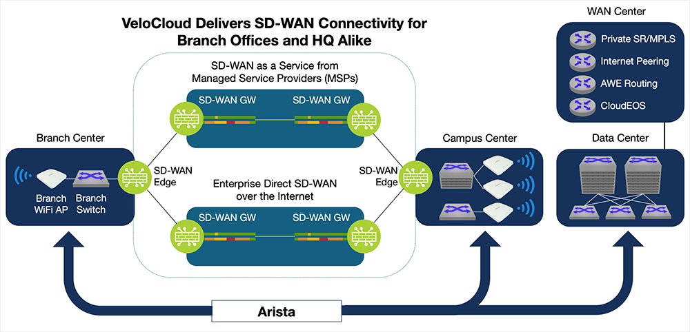
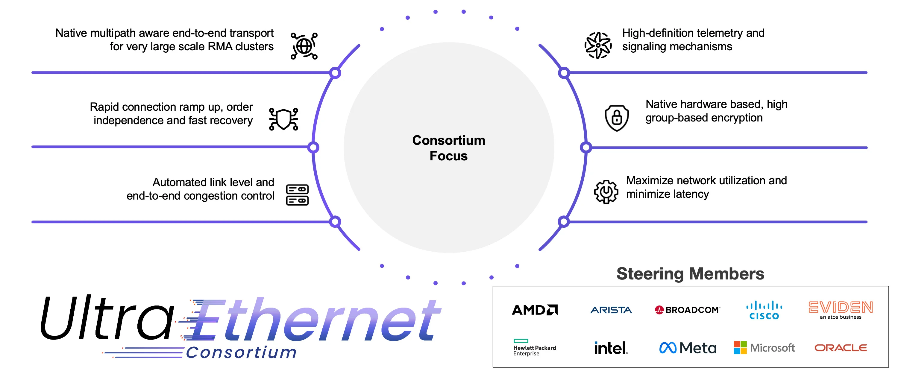
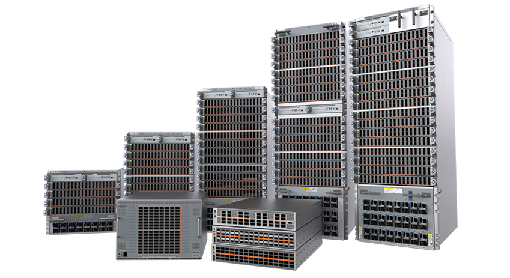

<!-- Google tag (gtag.js) -->

# Welcome to the August 2025 Edition of the Arista Federal Newsletter!

As the dog days of summer wind down and fall approaches, it’s the perfect time to reset, refocus, and bring fresh energy into the months ahead. We hope you enjoyed some well-deserved time with family and friends this summer and are recharged for a strong finish to the year.

In this edition, we highlight another milestone quarter for Arista. We posted $2.205 billion in revenue, a 30.4% year-over-year increase, and for the first time, non-GAAP operating income surpassed $1 billion. These results reflect strong momentum across AI, cloud, and enterprise sectors and underscore the strength of Arista’s data-driven networking strategy.

In July we were excited to share news of Arista’s acquisition of VeloCloud SD-WAN—a significant step in shaping the future of networking across campus, branch, and cloud. This strengthens our SD-WAN portfolio and reinforces our commitment to innovation at the enterprise edge. In this month’s newsletter, our CEO, Jayshree Ullal, discusses “Next Generation SD-WAN in the AI Era.”. Jayshree's a leader with both vision and engineering expertise, Jayshree continues to bridge technology and business to drive meaningful innovation.
As we head into fall, we look forward to sharing more updates, insights, and opportunities to help you advance your mission. As always, we welcome your feedback, this newsletter is for you. Please reach out with your ideas or requests at fed@aristafederal.com.

Thank you for reading the Arista Federal Newsletter, your go-to source for the latest Arista innovations, industry insights, and mission-focused networking solutions for Federal Agencies and System Integrators.

We welcome your feedback on the newsletter. If you have any ideas on what you want to see, please reach out to fed@aristafederal.com.  

---

## **Arista Blog**

<a href="https://blogs.arista.com/blog">
https://blogs.arista.com/blog
</a>

---

## **Next Generation SD-WAN in the AI Era**
By: Jayshree Ullal, CEO

The advent of cloud native applications in the 2025 era (CRM, SaaS, storage, or ERP apps) and the public cloud has caused a re-architecture of traditional WANs based on popular Ethernet and IP across cloud boundaries. Arista has been the thought leader and pioneer of this leaf-spine cloud network for data centers, and now we can see a seamless extension of this concept to the WAN and inter data center using the same principles that have served our customers. The distribution of applications across AI, cloud, SaaS, edge, and enterprise environments creates new challenges for wide area networking architecture and Internet routing to refine branch and WAN networks.
Evolution of WANs in the Agentic AI Wave

Today, everything changes all over again. Traditional “who, what, where, and why” factors are upended for modern WAN connectivity. In the old days, people in remote locations accessed centralized data over the WAN, with SD-WAN introduced to help reduce costs compared to dedicated MPLS circuits. Traffic flows were simple, involving many-to-one conversations from many distributed users to a few centralized data sources.

In the new AI era, the concepts of what comprises a user and a site in a WAN have changed fundamentally. The introduction of agentic AI even changes what might be considered a user. In addition to people accessing data on demand, new AI agents will be deployed to access data independently, adapting over time to solve problems and enhance user productivity. WAN sites could be anything going forward, including a laptop or smartphone, a house, an airplane, or any other location on the move. Data and applications, located anywhere, add complexity, whether in a central company data center, the public cloud, or distributed branch office sites.

New communication options in the WAN will also drive changes in WAN traffic patterns. Instead of many-to-one conversations, the rise of agentic AI will ensure any-to-any conversations with bi-directional bandwidth utilization. AI agents can be deployed anywhere, including in the public cloud, adding extra layers of complexity to WAN network designs.

**Arista and VeloCloud Coming Together**

Today, Arista is taking an important and relevant step to bridge the gap between enterprise and cloud WAN access. We are pleased to announce the acquisition of VeloCloud’s novel WAN portfolio from our partner, Broadcom. The new Arista + VeloCloud combination will provide modern WAN solutions for customers globally. VeloCloud’s secure, AI-optimized cloud WAN portfolio will provide seamless, application-aware solutions to connect customer sites of any type, complementing Arista’s leading data center and campus wired/wireless portfolio.

**Arista + VeloCloud: Better Together**

With the completion of the VeloCloud acquisition, our customers will now have rich configuration choices such as leafs/spokes for branch sites. This modern WAN architecture delivers multipathing, encryption, in-band network telemetry, segmentation, application identification, and traffic engineering into a single atomic identifier for WAN hub/spine and spoke/leaf applications. This is a natural and next step for a consistent platform, as shown in the figure below:

<figure markdown>

    <figcaption></figcaption>
</figure>

**VeloCloud-SD-WAN-Image**

“We have been using Arista and VeloCloud in production environments. The addition of the VeloCloud edge strengthens and scales the enterprise WAN network,” stated Alan Davidson, CIO of Broadcom, a leading and early customer.

VeloCloud has been an industry pioneer in secure SD-WAN connectivity, offering Security Service Edge (SSE) functionality for the Cloud WAN and working closely with SASE cloud security partners for the past decade. VeloCloud’s secure WAN heritage complements Arista’s zero trust enterprise for wired and wireless campuses, extending to branches as well. With the combined company, we look forward to delivering end-to-end zero trust networking across WAN and LAN domains.

**MSP and Branch Offerings**

The addition of the VeloCloud Edge for Cloud WAN and Managed Service Providers (MSPs) provides a portfolio of platforms with integrated security and wireless options, including both 5G and Wi-Fi, as well as a range of Ethernet ports and speeds for LAN and WAN connectivity. Announced today, brand-new POE-enabled campus switches with 1G, 10G, and 25G ports plus new indoor and outdoor Wi-Fi 7 access points, are the perfect options for customers to outfit branch offices using VeloCloud Cloud WAN products to connect each office back to headquarters using secure application optimization to protect and prioritize important business traffic.

VeloCloud products complement Arista’s broad campus wired and wireless product portfolio, as well as Arista’s cloud-native CloudEOS routing stack and EOS-based routing platforms. This combined portfolio will offer customers expanded options and deployment flexibility to meet any global WAN and LAN requirement from client to cloud.

**The Road Ahead**  

In today’s AI era, customers need more than traditional SD-WAN. WAN silos will no longer be viable, as traffic caused by generative AI in data centers (either on-premise or hosted in the cloud) will increasingly impact the WAN. Arista and VeloCloud share a common vision for client to cloud networking across WAN and LAN domains as evidenced by the recent announcement of Google’s Cloud WAN. This is a fitting example of this trend. We are excited to warmly welcome the Velo family, led by founder and former CEO Sanjay Uppal, as our seventh and largest acquisition to date. Welcome to our cognitive campus/branch offerings that modernize WAN networks!

---
## **Demystifying Ultra Ethernet** 
By: Tom Emmons and John Peach

The Ultra Ethernet Consortium (UEC), of which Arista is a founding member, is a standards organisation established to enhance Ethernet for the demanding requirements of Artificial Intelligence (AI) and High-Performance Computing (HPC). Over 100 member companies and 1000 participants have collaborated to evolve Ethernet, leading to the recent publication of its 1.0 specification, which will drive hardware implementations that significantly boost cluster performance.

<figure markdown>

    <figcaption></figcaption>
</figure>

In this blog, we will take a look at the need for Ultra Ethernet and the new capabilities it delivers.

Historically, AI/ML clusters have been specialist, independent technology islands. As AI/ML has become business-critical, there is a need for a common technology paradigm that integrates with existing enterprise fiscal, operational, and security frameworks. Ethernet and IP have a proven history of adapting over 50 years, and advanced Ethernet networking solutions, such as Arista's Etherlink™ portfolio, are already the chosen interconnect for the majority of AI accelerators (XPUs).

A central element of the UEC's vision is to take Ethernet performance to the next level by reimagining Remote Direct Memory Access (RDMA) as a native Ethernet application. RDMA is vital for the success of both AI and HPC applications, as it enables systems and processors to directly exchange data at high speed, currently 400 Gbps, with 800 Gbps in the near future. This efficient communication facilitates the distribution of workloads across numerous servers and processors, supporting parallel computation across many thousands of accelerators.

RDMA entails high flow rates and synchronized large-volume flows that pose challenges for unoptimized Ethernet networks. Without advanced switching features, large flows created hashing nightmares, requiring almost perfect traffic distribution to prevent congestion. The rapid startup and termination of RDMA flows offered traditional congestion control algorithms little time to react. While enhancements like Arista's Etherlink already substantially improve performance beyond alternative proprietary approaches, the next level of universal optimization necessitates a rethinking of how applications interact with the network.

This is where Ultra Ethernet Transport (UET) comes in, designed to make RDMA a native Ethernet application by incorporating new traffic distribution semantics and modern congestion control on top of standard Ethernet and IP layers. UET aims to meet the demands of contemporary and traditional HPC workloads without requiring proprietary infrastructure.

<figure markdown>

    <figcaption></figcaption>
</figure>

**Key Aspects of Ultra Ethernet Transport (UET)**

UET addresses the limitations of traditional RDMA networking from several angles to provide a comprehensive new transport paradigm for both HPC and AI/ML workloads. We’ll take a look at some of the innovations below:

|  Traditional RDM | Ultra Ethernet | 
| :-----------: | :-----------: |
|RDMA tunneled over Ethernet	|Closely coupled API and transport|
|Single cluster scaling in tens of thousands	|Designed for scaling over 1M endpoints|
|No native security implementation	|Native highly scalable group-based encryption|
|Requires in order delivery	|Native support for out-of-order packet delivery|
|Multi-pathing at flow level	|Per-packet multipathing (spraying)|
|Inefficient go-back-N loss recovery	|Per-packet loss recovery|
|Coarse congestion management and recovery	|Fine-grained sender and receiver based congestion control|
|Inflexible network tuning paradigm	|Semantic-level configuration of workload tuning|
 

**Native Libraries:** To achieve maximum performance, UET effectively implements a native transport layer for the ubiquitous libfabric 2.0 API. For many applications, the transition to UET is straightforward, requiring minimal or no application changes.

**Optimized Traffic Forwarding:** A fundamental concept of UET is the evolution from traditional flow-based traffic distribution to source-based packet spraying. Unlike proprietary solutions, UET is built from the ground up for packet spraying for all message types, ensuring optimal efficiency at every layer.

**Advanced Connection and Congestion Management:** Traditional methods of setting up new connections (e.g., 3-way handshake) are time and resource intensive. Congestion algorithms are optimized for general traffic patterns and recovering from packet loss triggers inefficient "go-back-N" operations, which require many packets to be resent, impacting both the sender and the receiver, as well as the network itself. UET provides significant optimization for all of these cases, including:

*	__Ephemeral Connections:__ Enable fast connection startup, eliminating the round-trip handshake delay before data begins to flow.
*	__Selective Retransmission:__ Enables retransmission of individual lost packets, reducing the network-wide impact of a dropped packet from full round-trip time to a single packet.
*	__Packet Trimming:__ Efficiently notifies both receiver and sender of packet loss and congestion, allowing rapid mitigation and recovery.
*	__Network Signal Congestion Control (NSCC):__ Sender-based algorithm that paces transmission rates upon detecting congestion.
*	__Receiver Credit Congestion Control (RCCC):__ Receiver-based mechanism to manage "in-cast" scenarios by controlling sender traffic rates.

**Security:** Given the value of AI models and intellectual property, security of data in-flight is mandatory, especially in multi-tenant environments. UET treats security as a fundamental objective, offering optional end-to-end encryption and authentication based on an advanced group keying scheme that allows all members of a job (e.g., all XPUs for one tenant) to operate in an encrypted bubble, protecting model data from exposure and preventing data injection or exfiltration by other tenants on the network.

In summary, the UEC specification modernises the relationship between AI/HPC applications and networks. By tightly integrating application semantics with network behaviours, it creates a native transport mechanism that combines the strengths of RDMA with best-in-class Ethernet solutions, forming a powerful foundation for the next generation of applications.

<figure markdown>

    <figcaption></figcaption>
</figure>

Arista, as the leading provider of advanced Ethernet solutions for AI/ML clusters and a founding member of the UEC, is committed to this vision. With its current Etherlink portfolio already being UET-ready, and ongoing efforts to develop future systems and collaborate with other pioneers to build optimal Ethernet networks for high-performance computing, we look forward to cementing the leadership of Ethernet as a universal interconnect. For more details on UET, please review our whitepaper here.

---
## **Initial Onboarding Of Your Arista Device: The DO's and DO NOT's**
By: Akashdeep Takhar, Advanced Services Engineer, Southwest Region    

The day has finally arrived: You are ready to rack your new Arista switch and begin to onboard it to production. After waiting for shipment, scheduling the team to rack the switches, and allocating space in your environment, you can now start to use the switch. However, there are some checklist items that we need to take into consideration to prevent problems from arising. Poor preparation leads to poor execution, and as an Advanced Service Engineer that has seen problems occur, it’s best to have some action items taken care of early on. Listed below are 4 best practices to use during the initial onboarding of your devices. In addition, we have also included 4 crucial steps you should avoid in order to execute the onboarding process to perfection with the least amount of trouble.   

<figure markdown="span">
  
  <figcaption></figcaption>
</figure>  

__Do List:__

1.  If using Zero Touch Provisioning, please set up Option 66 and 67 on your DHCP Server:   
   To enable ZTP for initial onboarding, it is required to enable options 66 and 67 within your DHCP server for the Arista switches to grab a configuration file. Note that if you are running EOS version 4.30.X and above, this requirement is not necessary. The purpose of ZTP is to have a pre-set configuration installed onto your switch. In addition, the next step is to check for reachability to Arista.io   
2. Ensure that you have the proper length rack mounts:  
  Sometimes we are busy with discussion of architecture, so busy that in fact we glance over some detail that might seem obvious. Upon arrival of your device, ensure that the proper rack equipment is ready to hold the switches in place. If a custom rack mount is needed, your fellow SE would be more than happy to find one for you.  
3. Determine method of device management:    
  Depending on your choice of either in band or out of band management, it is best practice to have that decision made before the devices are set up. One of the final steps to ensure that onboarding is complete is for the device to reach out to your cloud tenant instance on https://arista.io. Open port 443 to gain reachability to https://arista.io if using CloudVision as a Service (CVaaS). 
4. Create a Port Map for device connectivity:  
  Time saving step here. Wiring devices together seems easy, until you realize the distance between devices are far apart or that the port speed is not what you had expected. Save time by creating a design or port mapping sheet to quickly wire devices together.    

<figure markdown="span">
  
  <figcaption></figcaption>
</figure> 

__Do NOT:__

1. Do not wait last minute to see if your CVP instance is set up:   
  As your equipment arrives, it’s best practice to begin communicating with the Account Manager to check for your CVP instance. If it’s not ready, and your equipment arrives, this may add additional time to your plans for onboarding the devices to use CVP.  
2. Do not wait to build configurations for the device, as they begin to onboard:  
  Having at least an idea of the features and protocols to use prior to the device’s arrival is crucial. Without having a set plan, or even discussing the protocols to use, will add more time to setting up your network. If there is a set deadline, this should be a high priority. It’s best to have this set up as the devices ship over, even better when talking to your SE representative to have questions answered faster.  
3. Do not forget to check transceiver and optic bandwidth capabilities:  
  This is one of those steps that we might overlook because we are sure the fibers and optics will work together….until it doesn’t. Mismatch speeds and troubleshooting Layer 1 problems take longer than anticipated since there are many sources of truth for the issue.   

If you’re able to limit the amount of time it takes to troubleshoot the matter because you had prepared ahead of time, wouldn’t your future self thank you for that? Of course, at Arista we have teams that help with the onboarding process, along with SE’s that check to see if the essential fundamentals of your networks are ready for production. If there’s any questions regarding the onboarding process of your new devices, please ask and we would be happy to help!  

Additional tips here, click the links below:  
[Tips and Tricks](https://arista.my.site.com/AristaCommunity/s/article/eos-tricks-and-tips-that-make-life-easier)    

---

## __*Upcoming Events*__  
Arista hosts various events throughout the year for you! Members of our team organize these informative events to showcase Arista's ability to not only help improve your network, but to also assist by providing a set of tools to improve your operations! Click on the boxes below to be directed to Arista's website for lists of Webinars and Events.

-   __Arista Network Webinars Series with Carahsoft__

    

    |  Date | Name| Description | 
    | :-----------: | :-----------: | :-----------: |
    | __July 15__   | Positioning Arista to the Federal Government | Learn how to effectively align Arista's solutions with federal IT missions. The session will provide key messaging, solution positioning, and success stories tailored to the government sector. |
    | __September 9__ |  Arista Campus Solutions | Discover how Arista is extending its reliable, scalable, and secure networking capabilities to campus environments that are perfect for federal agencies with distributed locations. |
    | __October 14__ | vSphere Integration | Join Paul Mancuso, Systems Engineer at Arista Networks, for an in-depth look at how Arista's CloudVision and EOS streamline integration with VMware vSphere.. This session will explore how Arista's solutions enhance automation, visibility, and operational efficiency across virtualized federal data centers. Learn how to simplify network operations and accelerate mission outcomes through seamless vSphere integration. |

    [Register Here](https://carahevents.carahsoft.com/Event/Details/618442-arista-networks){.md-button}

-   __Webinars__  

    --- 

    We make is easy for you to view products that are of interest, all virtually! Technical memebers of the team showcase outstading explanation of the products. Click below to see our list of Webinars. 

    [Arista Webinars](https://www.arista.com/en/company/news/webinars){.md-button}

-   __Events__ 

    ---
    Join us in person to get a closer look in our list of produts and solution, as well as get the chance to meet members of the team. Click below to see our list of ipcoming Events. 

    [Upcoming Events](https://www.arista.com/en/company/news/events){ .md-button }

--- 

## __*Software Updates*__
<figure markdown>
{: style="height:200px;width:300px"}    
    <figcaption></figcaption>
</figure>
For new code releases, click [here](https://www.arista.com/en/support/software-download) 

   |  Softwares    | Versions      |  Release Date |
   | :-----------: | :-----------: | :-----------:
   | __EOS__           | 4.32.6.1M   4.33.4M   4.32.6M   4.34.1F    | July 2nd, 2025   June 23rd, 2025   June 20th, 2025   June 16th, 2025   
   | __CVP__           | Portal 2025.2.0   Appliance 7.0.1   Sensor 1.1.0      | July 4th, 2025   January 28th, 2025  March 24th, 2025  
   | __DMF__           | 8.6.2  | June 23rd, 2025   
   | __WLAN__  CV-CUE Wireless Manager  |   19.0.0  19.0.0        |   July 25th, 2025 June 12th, 2025 
   | __Arista NDR__         | 5.3.5         | July 16th, 2025
   | __TerminAttr__    | 1.37.2         | April 9th, 2025   

---

## __*Software Advisories*__
Below is a list of advisories that are announced by Arista. To view more details on the specific advisories, please click the links in the middle row.

| Name          | Advisory Link           | Date of Advisory Notice  |
| :-----------: |:-------------:| :-----:|
|  __Global Common Encryption Key__   | [Security Advisory 0122](https://www.arista.com/en/support/advisories-notices/security-advisory/22022-security-advisory-0122)  | July 22nd, 2025   |  
|  __UDP Source Port 3503 Packets__   | [Security Advisory 0121](https://www.arista.com/en/support/advisories-notices/security-advisory/22021-security-advisory-0121)  | July 22nd, 2025   |  
|  __Neighbor AP Detection on Wi-Fi 7 AP's__   | [Field Notice 0106](https://www.arista.com/en/support/advisories-notices/field-notice/22024-field-notice-0106)  | July 29th, 2025   |  
|  __Deprecated Command Removal__   | [Field Notice 0105](https://www.arista.com/en/support/advisories-notices/field-notice/22016-field-notice-0105)  | July 14th, 2025   | 
|  __Prolonged Network Churn Events__   | [Field Notice 0104](https://www.arista.com/en/support/advisories-notices/field-notice/22011-field-notice-0104)  | July 14th, 2025   |   
|  __Secure Boot__   | [Field Notice 0103](https://www.arista.com/en/support/advisories-notices/field-notice/21651-field-notice-0103)  | July 1st, 2025   |  

For a list of the most current advisories and notices, click [Here](https://www.arista.com/en/support/advisories-notices)

---

## __*Product Updates*__
<figure markdown>
{: style="height:200px;width:400px"}   
    <figcaption></figcaption>
</figure>
**End of Sale** notices are listed below.

| Device        | Name           | End Of Sale Date  |
| :-----------: |:-------------: |     :----:        |
| Software      | [End of Software for CloudVision Portal 2023.2](https://www.arista.com/en/support/advisories-notices/end-of-support/21412-end-of-software-support-for-cloudvision-portal-2023-2-release-train) [End of Software Support for EOS 4.28](https://www.arista.com/en/support/advisories-notices/end-of-support/21275-end-of-software-support-for-eos-4-28) [DMF and CCF Deployments on Accton/ Edgecore Switches](https://www.arista.com/en/support/advisories-notices/end-of-support/21094-end-of-support-for-dmf-and-ccf-deployments-on-accton-edgecore-switches) [EOS-4.34 and later no longer supported on select switches](https://www.arista.com/en/support/advisories-notices/end-of-support/21089-end-of-software-support-for-7280r-r2-7500r-r2-and-7020r-series)  | May 27th. 2025   March 14, 2025  January 31st, 2025  January 15th, 2025   |
| CVP           | [CVP IPAM Application](https://www.arista.com/en/support/advisories-notices/endofsupport)   [CVP 2023.3](https://www.arista.com/en/support/advisories-notices/end-of-support/21627-end-of-software-support-for-cloudvision-portal-2023-3-release-train)          |  July 14th, 2025   June 17th, 2025   |
| DMF           | [DMF 8.3](https://www.arista.com/en/support/advisories-notices/end-of-support/21417-end-of-software-support-for-dmf-8-3)          |  June 3rd, 2025           |
| Switches      | [DCS-7020R Series](https://www.arista.com/en/support/advisories-notices/end-of-sale/21052-end-of-sale-of-the-arista-dcs-7020r-series)  |  December 20th, 2024  |

**New Releases** of Arista's device are listed below 

|  Device       | More Information |  Release Date 
    | :-----------: | :-----------:    | :-----------:
    | Arista VeloCloud | [VeloCloud Acquisition](https://www.arista.com/en/company/news/press-release/21646-pr-07012025) | Q3 2025
    |  Arista SWAG    |   [Modern Stacking for Campus](https://www.arista.com/en/company/news/press-release/20693-pr-12032024)                | Q3 2025 
    | Arista Multi-Domain Segmentaton Service  | [Arista MSS](https://www.arista.com/en/company/news/press-release/19297-pr-20240430)         | Q3 2024
    | Arista CV UNO  | [CloudVision Universal Network Observability](https://www.arista.com/en/company/news/press-release/19195-pr-20240305)  | Q1 2024

---
# *Feel Free to Reach Out To Us For Your Network Needs* 
<figure markdown>
{: style="height:300px;width:800px"}  
    <figcaption></figcaption>
</figure>
We thank you for taking the time to read out newsletter today. Feel free to reach out to your SE or ASE for more information or questions regardsing your network operations. Until next month, have a good one! 