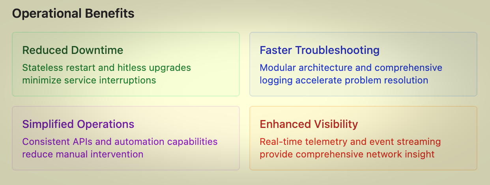

<!-- Google tag (gtag.js) -->

# Welcome to the October 2025 Edition of the Arista Federal Newsletter!

Happy Government New Year!

We hope everyone successfully navigated the fiscal year-end rush and is ready to kick off FY26 with fresh momentum. As the Government reopens for business and programs accelerate, it’s the perfect time to refocus on mission priorities and innovation. At Arista, we're excited to continue partnering with our Federal and System Integrator customers to simplify operations, strengthen security, and power the next wave of mission success.  

In this edition we share two exciting articles:

* __Introduction to Arista EOS — Simplifying Networking, Powering Innovation__ -- Arista Technical Solutions Engineer Elumalai Neelamegam provides a comprehensive overview of Arista's Extensible Operating System (EOS) architecture, exploring its innovative design principles and core components.

* __Simplifying Campus Network Operations with CloudVision Network Hierarch__ -- Arista Advanced Services Engineer Alex Bojko shares valuable insights on CloudVision offering practical takeaways for our Federal and System Integrator customers

We always welcome your feedback, ideas, and requests at fed@aristafederal.com.

Thank you for reading the Arista Federal Newsletter — your trusted source for innovation, industry insight, and mission-focused networking solutions for Federal Agencies and System Integrators.

---

## **Arista Blog**

---

## **Arista EOS Architecture** ##

By: Elumalai Neelamegam, Technical Solutions Engineer – EMEA

A comprehensive overview of Arista's Extensible Operating System (EOS) architecture, exploring its innovative design principles and core components.

**Introduction to Arista EOS**

Arista Networks' Extensible Operating System (EOS) represents a fundamental paradigm shift in network operating system design. Unlike traditional monolithic network operating systems, EOS is built from the ground up with modern software engineering principles, emphasizing modularity, programmability, and operational simplicity.

At its core, EOS is designed to address the limitations of legacy network operating systems that struggle with the demands of modern data center and cloud networking environments. These environments require rapid deployment, automated operations, and the ability to adapt quickly to changing requirements.

**Key Design Principles**

* State-oriented: All network state is centralized and consistent
* Event-driven: Components react to state changes in real-time
* Modular: Independent agents handle specific functions
* Programmable: Extensive APIs enable automation and integration

**Core Architecture Overview**

The Arista EOS architecture is fundamentally different from traditional network operating systems. Instead of a monolithic design where all networking functions are tightly coupled, EOS employs a distributed, agent-based architecture centered around a unified system database (SysDB).

This architecture provides several key advantages:

* Fault Isolation: Agent failures don't cascade to other system components
* Independent Development: Agents can be developed, tested, and updated independently
* Consistent State: All system state is maintained in a single, authoritative database
* Event-Driven Operations: Changes propagate automatically through the system

<figure markdown>

    <figcaption></figcaption>
</figure>

This architecture provides several key advantages:

* Fault Isolation: Agent failures don't cascade to other system components
* Independent Development: Agents can be developed, tested, and updated independently
* Consistent State: All system state is maintained in a single, authoritative database
* Event-Driven Operations: Changes propagate automatically through the system

**Key System Components**

EOS consists of several critical components that work together to provide comprehensive networking functionality. Understanding these components is essential to appreciating the system's design and capabilities.

<figure markdown>

    <figcaption></figcaption>
</figure>

**SysDB - The Central Database**

The System Database (SysDB) is the heart of the EOS architecture. It serves as the single source of truth for all system state, configuration, and operational data. This centralized approach ensures consistency across all system components and enables powerful features like transactional updates and event notifications.

**Key Characteristics**

* In-memory database: Optimized for fast access and updates
* Hierarchical structure: Organized as a tree of interconnected tables
* ACID transactions: Ensures data consistency during updates
* Event notifications: Automatic updates when data changes
* Persistent storage: Critical data survives system restarts

**Example: BGP Route Processing**

When a BGP route is received, the BGP agent updates the SysDB routing table. This automatically triggers notifications to the FIB agent, which programs the hardware forwarding tables, and to any monitoring applications subscribed to routing changes.

**Agent-Based Architecture**

Agents are independent processes that implement specific networking functions. Each agent is responsible for a particular aspect of network operation, such as routing protocols, link aggregation, or network monitoring. This modular approach provides numerous benefits over monolithic designs.

The agent-based design enables several key capabilities:

* Stateless Restart: Agents can restart without losing system state
* Independent Updates: Individual agents can be updated without system downtime
* Resource Isolation: Memory and CPU usage are isolated per agent
* Debugging Simplification: Issues can be isolated to specific agents

<figure markdown>

    <figcaption></figcaption>
</figure>

The agent-based design enables several key capabilities:

* Stateless Restart: Agents can restart without losing system state
* Independent Updates: Individual agents can be updated without system downtime
* Resource Isolation: Memory and CPU usage are isolated per agent
* Debugging Simplification: Issues can be isolated to specific agents

**APIs and Programmability**

One of EOS's most significant advantages is its comprehensive programmability. The system provides multiple APIs and interfaces that enable automation, integration, and custom application development.

<figure markdown>

    <figcaption></figcaption>
</figure>

**Advanced Features**

EOS includes numerous advanced features that distinguish it from traditional network operating systems. These features are enabled by the underlying architecture and provide significant operational benefits.

<figure markdown>

    <figcaption></figcaption>
</figure>

<figure markdown>

    <figcaption></figcaption>
</figure>

<figure markdown>

    <figcaption></figcaption>
</figure>

**Benefits and Use Cases**
The architectural decisions in EOS deliver tangible benefits across various deployment scenarios. These benefits make EOS particularly well-suited for modern data center and cloud networking environments.

<figure markdown>

    <figcaption></figcaption>
</figure>

<figure markdown>

    <figcaption></figcaption>
</figure>

**Conclusion**

Arista EOS represents a significant evolution in network operating system design, moving beyond the limitations of traditional monolithic architectures to embrace modern software engineering principles. The agent-based architecture, centralized state management through SysDB, and comprehensive programmability provide a robust foundation for modern networking requirements.

The benefits of this architecture extend beyond technical capabilities to deliver real operational advantages: reduced downtime, simplified troubleshooting, enhanced automation capabilities, and improved network visibility. These advantages make EOS particularly well-suited for environments where network reliability, performance, and operational efficiency are critical.

**Looking Forward**

As network requirements continue to evolve with trends like edge computing, 5G, and IoT, the architectural principles embodied in EOS provide a solid foundation for addressing future challenges. The system's modularity and programmability ensure that it can adapt to new requirements while maintaining the stability and performance that modern networks demand.

For network engineers and architects evaluating modern networking solutions, understanding EOS architecture provides valuable insights into how contemporary network operating systems can address the challenges of today's dynamic, high-performance networking environments.

---

## **Simplifying Campus Network Operations with CloudVision Network Hierarchy**
By: Alex Bojko, Advanced Services Engineer, Southwest Region    

Managing modern campus networks can prove to be a challenging task that can feel overwhelming at times. Campus networks encompass large numbers of remote sites, each with unique characteristics and various devices to manage. In order to simplify the management of such a distributed infrastructure, Arista has introduced Network Hierarchy in CloudVision.     

Overseeing such a deployment and gaining visibility into various sites and device connections is a difficult task to accomplish. When an issue arises, locating that issue and pinpointing it to a specific site can be an extremely difficult task. Configuration across sites can also be difficult to standardize and modify when needed.  

Network Hierarchy is a feature meant to simplify campus network management, and was introduced to Arista CloudVision to help address these pain points at scale.  

Network Hierarchy in CloudVision provides a logical, tree-like structured view that allows you to group devices together by location. Instead of a linear list of devices that are scattered across your infrastructure, Network Hierarchy provides an organized, simple to comprehend view that allows you to navigate seamlessly between campus networks that you manage using the tree-like structured navigation panel. This structure works at scale, making it easy to oversee and manage large deployments with many physical locations. Each Campus is organized within the hierarchy, with devices grouped by physical location and operational use.  

<figure markdown="span">
  
  <figcaption>Network Hierarchy Page</figcaption>
</figure>  

Within each Campus defined in Network Hierarchy, statistics and metrics are displayed that provide a comprehensive overview tailored to what is happening at each individual site. Metrics include statistics from both the wired and wireless side, Uplink health, MLAG Status, authentication information, connectivity monitor status, and a logical topology view of the Campus network.  This allows operators to quickly go from a global, network wide view, to a site/device specific, interface specific, drilled down view. Having this flexibility allows for faster MTTR, as issues are able to be isolated far more quickly and efficiently. Operators can locate issues that are specific to a site, and from there drill down to determine the exact device or devices experiencing the issues.  

<figure markdown="span">
  
  <figcaption>Network Hierarchy Port Specific View</figcaption>
</figure>   

Network Hierarchy also allows for access layer interface configuration via the Access Interface Configuration Quick Action in CloudVIsion. Here, the operator can rapidly assign access layer port configuration to individual or groups of interfaces. This further simplifies day 2 operations, as any campus device switchport configuration can be viewed and modified as needed, all from the Network Hierarchy view.  

To learn more about Network Hierarchy, the metrics it provides, how to run diagnostics, and how it can simplify your Campus network management, click the link below.  
[Arista Network Hierarchy Guide](https://www.arista.io/help/articles/bmV0d29ya0hpZXJhcmNoeS5BbGwubmV0d29ya0hpZXJhcmNoeQ==) 

---

## __*Upcoming Events*__  
Arista hosts various events throughout the year for you! Members of our team organize these informative events to showcase Arista's ability to not only help improve your network, but to also assist by providing a set of tools to improve your operations! Click on the boxes below to be directed to Arista's website for lists of Webinars and Events.

-   __Arista Network Webinars Series with Carahsoft__

    __For Channel Partners Only__

    

    |  Date | Name| Description | 
    | :-----------: | :-----------: | :-----------: |
    | __October 14__ | Data Center Networking Solutions & Operations in the Era of DOGE | Join Mitch Vaughn, Principal Systems Engineer at Arista, for a session on optimizing data center strategies with Arista's innovative technologies. He will cover how to position Arista effectively in the data center, highlight the advantages of a single OS and CloudVision with AVD for streamlined operations and explain the Arista licensing model for EOS features and CloudVision. The session will also touch on the hardware lifecycle management, the value of AVD with real-world deployment metrics, and Arista's approach to code quality through CVE metrics. Mitch will share insights into commonly deployed platforms, and discuss tools for enhanced visibility, real-time bug scrubs, and proactive CVE notifications. For channel partners only. |
    | __November 18__ | Arista Campus Solutions | Discover how Arista is extending its reliable, scalable, and secure networking capabilities to campus environments that are perfect for federal agencies with distributed locations. For channel partners only. |

    [Register Here](https://carahevents.carahsoft.com/Event/Details/618442-arista-networks){.md-button}

-   __Webinars__  

    --- 

    We make is easy for you to view products that are of interest, all virtually! Technical memebers of the team showcase outstading explanation of the products. Click below to see our list of Webinars. 

    [Arista Webinars](https://www.arista.com/en/company/news/webinars){.md-button}

-   __Events__ 

    ---
    Join us in person to get a closer look in our list of produts and solution, as well as get the chance to meet members of the team. Click below to see our list of ipcoming Events. 

    [Upcoming Events](https://www.arista.com/en/company/news/events){ .md-button }

--- 

## __*Software Updates*__
<figure markdown>
{: style="height:200px;width:300px"}    
    <figcaption></figcaption>
</figure>
For new code releases, click [here](https://www.arista.com/en/support/software-download) 

   |  Softwares    | Versions      |  Release Date |
   | :-----------: | :-----------: | :-----------:
   | __EOS__           | 4.34.2F  4.32.6.1M   4.33.4M   4.32.6M    | August 3rd, 2025  July 2nd, 2025   June 23rd, 2025   June 20th, 2025   
   | __CVP__           | Portal 2025.2.1   Appliance 7.0.1   Sensor 1.1.1      | August 21st, 2025   January 28th, 2025  July 14th, 2025  
   | __DMF__           | 8.8.0  | August 15th, 2025   
   | __WLAN__  CV-CUE  |   19.0.0        |   July 25th, 2025   
   | __Arista NDR__         | 5.3.5         | July 16th, 2025
   | __TerminAttr__    | 1.39.1         | July 18th, 2025    
   | __VeloCloud SD-WAN__   Orchestrator/ Gateway / Edge   |  6.4.0         |   May 2nd, 2025   

---

## __*Software Advisories*__
Below is a list of advisories that are announced by Arista. To view more details on the specific advisories, please click the links in the middle row.

| Name          | Advisory Link           | Date of Advisory Notice  |
| :-----------: |:-------------:| :-----:|
|  __Global Common Encryption Key__   | [Security Advisory 0122](https://www.arista.com/en/support/advisories-notices/security-advisory/22022-security-advisory-0122)  | July 22nd, 2025   |  
|  __UDP Source Port 3503 Packets__   | [Security Advisory 0121](https://www.arista.com/en/support/advisories-notices/security-advisory/22021-security-advisory-0121)  | July 22nd, 2025   |  
|  __AP Kernal Panics__   | [Field Notice 0115](https://www.arista.com/en/support/advisories-notices/field-notice/22422-field-notice-0115)  | September 20th, 2025   |  
|  __Updated Redirector for AP__   | [Field Notice 0114](https://www.arista.com/en/support/advisories-notices/field-notice/22418-field-notice-0114)  | September 19th, 2025   |  
|  __Guest Manager UI to CV-CUE__   | [Field Notice 0113](https://www.arista.com/en/support/advisories-notices/field-notice/22417-field-notice-0113)  | September 19th, 2025   |  
|  __Update of Radsec Certificates__   | [Field Notice 0112](https://www.arista.com/en/support/advisories-notices/field-notice/22400-field-notice-0112)  | September 11th, 2025   |  
|  __CVP Reverse Proxy__   | [Field Notice 0111](https://www.arista.com/en/support/advisories-notices/field-notice/22238-field-notice-0111)  | September 3rd, 2025   |  
|  __CVP Disc Usage__   | [Field Notice 0110](https://www.arista.com/en/support/advisories-notices/field-notice/22237-field-notice-0110)  | September 3rd, 2025   | 
 

For a list of the most current advisories and notices, click [Here](https://www.arista.com/en/support/advisories-notices)

---

## __*Product Updates*__
<figure markdown>
{: style="height:200px;width:400px"}   
    <figcaption></figcaption>
</figure>
**End of Sale** notices are listed below.

| Device        | Name           | End Of Sale Date  |
| :-----------: |:-------------: |     :----:        |
| Software      | [End of Software for CloudVision Portal 2023.2](https://www.arista.com/en/support/advisories-notices/end-of-support/21412-end-of-software-support-for-cloudvision-portal-2023-2-release-train) [End of Software Support for EOS 4.28](https://www.arista.com/en/support/advisories-notices/end-of-support/21275-end-of-software-support-for-eos-4-28) [DMF and CCF Deployments on Accton/ Edgecore Switches](https://www.arista.com/en/support/advisories-notices/end-of-support/21094-end-of-support-for-dmf-and-ccf-deployments-on-accton-edgecore-switches) [EOS-4.34 and later no longer supported on select switches](https://www.arista.com/en/support/advisories-notices/end-of-support/21089-end-of-software-support-for-7280r-r2-7500r-r2-and-7020r-series)  | May 27th. 2025   March 14, 2025  January 31st, 2025  January 15th, 2025   |
| CVP           | [CVP IPAM Application](https://www.arista.com/en/support/advisories-notices/endofsupport)   [CVP 2023.3](https://www.arista.com/en/support/advisories-notices/end-of-support/21627-end-of-software-support-for-cloudvision-portal-2023-3-release-train)          |  July 14th, 2025   June 17th, 2025   |
| DMF           | [DMF 8.3](https://www.arista.com/en/support/advisories-notices/end-of-support/21417-end-of-software-support-for-dmf-8-3)          |  June 3rd, 2025           |  
| CCF           | [CCF Product Line](https://www.arista.com/en/support/advisories-notices/end-of-sale/22430-end-of-sale-end-of-life-for-arista-ccf-product-line)          |  October 1st, 2025           |  
| Switches      | [7010TX-48-DC Switch](https://www.arista.com/en/support/advisories-notices/end-of-sale/22421-end-of-sale-of-the-arista-7010tx-48-dc-switches)  [7050CX3-32S Switch](https://www.arista.com/en/support/advisories-notices/end-of-sale/22419-end-of-sale-of-the-arista-7050cx3-32s-switches)  [CCS-720XP-96ZC2 Switch with 4GB DRAM](https://www.arista.com/en/support/advisories-notices/end-of-sale/22403-end-of-sale-of-the-arista-ccs-720xp-96zc2-switches-with-4gb-dram)  [CCS-720D Switches with 4GB DRAM](https://www.arista.com/en/support/advisories-notices/end-of-sale/22402-end-of-sale-of-the-arista-ccs-720d-switches-with-4gb-dram)  [CCS-710P-12 Switch](https://www.arista.com/en/support/advisories-notices/end-of-sale/22401-end-of-sale-of-the-arista-ccs-710p-12-switch) |  September 19th, 2025  September 19th, 2025  Septemebr 12th, 2025  September 12th, 2025  September 12th, 2025 |
| VeloCloud      | [SASE Secured by Symantec](https://www.arista.com/en/support/advisories-notices/end-of-sale/22072-end-of-sale-life-velocloud-sase-secured-symantec)  [Software Defined (SD) Access](https://www.arista.com/en/support/advisories-notices/end-of-sale/21653-end-of-sale-end-of-life-for-velocloud-software-defined-sd-access)   |  August 20th, 2024   July 1st, 2025 | 

**New Releases** of Arista's device are listed below 

|  Device       | More Information |  Release Date 
    | :-----------: | :-----------:    | :-----------:
    | Arista VeloCloud | [VeloCloud Acquisition](https://www.arista.com/en/company/news/press-release/21646-pr-07012025) | Q3 2025
    |  Arista SWAG    |   [Modern Stacking for Campus](https://www.arista.com/en/company/news/press-release/20693-pr-12032024)                | Q1 2025 
    | Arista Multi-Domain Segmentaton Service  | [Arista MSS](https://www.arista.com/en/company/news/press-release/19297-pr-20240430)         | Q3 2024
    | Arista CV UNO  | [CloudVision Universal Network Observability](https://www.arista.com/en/company/news/press-release/19195-pr-20240305)  | Q1 2024

---
# *Feel Free to Reach Out To Us For Your Network Needs* 
<figure markdown>
{: style="height:300px;width:800px"}  
    <figcaption></figcaption>
</figure>
We thank you for taking the time to read out newsletter today. Feel free to reach out to your SE or ASE for more information or questions regardsing your network operations. Until next month, have a good one! 