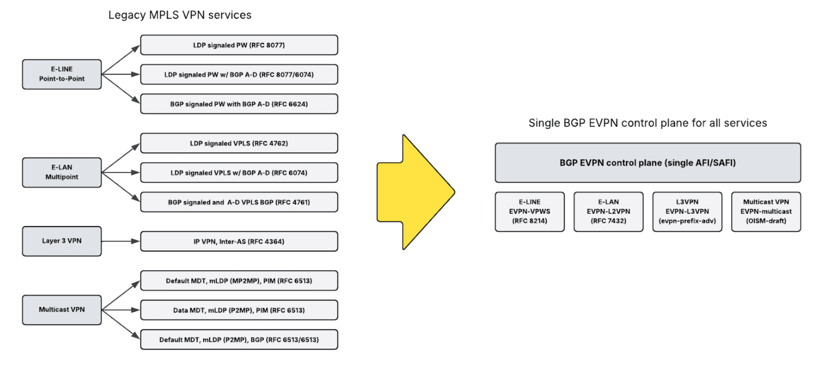

<!-- Google tag (gtag.js) -->

[![Image Placement][1]][2]
[1]: img/arista-federal-logo.png
[2]: http://www.aristafederal.com

# Welcome to the December 2025 Edition of the Arista Federal Newsletter!

INTRO

---

## **Arista Blog**

[![Image Placement][3]][4]
[3]: img/blog.png
[4]: https://blogs.arista.com/blog

---

ARTICLE #1

---

## **Benefits of Replacing Legacy MPLS VPN Services with EVPN**

By Jeff Colburn, Systems Engineer, US Federal

For nearly two decades, Multiprotocol Label Switching (MPLS) has served as the foundation of carrier-grade VPN and service delivery. However, as enterprise and service provider networks evolve toward cloud-native, software-defined (SDN), and virtualization-driven architectures, traditional MPLS pseudowire, Layer 2 (VPLS) and Layer 3 VPN (IP-VPN) services increasingly reveal their limitations. Ethernet VPN (EVPN) has emerged as the modern control plane that not only replaces legacy MPLS services but also enhances scalability, flexibility, and operational simplicity across data center, WAN, and campus environments.

Traditional MPLS VPNs, whether pseudowire, IP-VPN or VPLS, use a combination of LDP and BGP to build forwarding tables and isolate customer traffic. While robust, these technologies were designed for static, service-provider-centric environments and lack the simplificity and efficiency required in cloud-scale networks.

EVPN redefines this approach by using BGP as a unified control plane for pseudowire, Layer 2 and Layer 3 VPN services. It introduces a route-type framework that enables MAC and IP information to be distributed efficiently, reducing flooding and improving convergence.

| **Route-Type** | **Name** | **Description** |
| --- | --- | --- |
| 1   | Ethernet Auto-Discovery (AD) route | Remote discovery of dual-homed segments |
| 2   | MAC/Host IP route | Locally learned MAC address and Host IP address |
| 3   | Inclusive Multicast Ethernet Tag (IMET) Route | EVI membership advertisement |
| 4   | Ethernet Segment Route | Discover Ethernet Segment peers |
| 5   | IP Prefix Route | IP prefix advertisement |

The following are the key benefits of EVPN over legacy MPLS VPN services:

- **Control Plane MAC Address Learning**

MAC address learning is accomplished through the control plane using BGP, rather than through VPLS' flood-and-learn mechanism across the data plane. MAC moves and changes are no longer dependent on aging timers and flooding. EVPN's use of BGP provides near-real time updates and faster convergence.

- **Multi-Tenancy Support**

EVPN provides multi-tenant support by using BGP as a unified control plane to carry both Layer 2 and Layer 3 VPN information. Each tenant is assigned a unique EVPN Instance (EVI) identified by a Route Distinguisher (RD) and Route Target (RT), ensuring complete isolation of control and data planes. IP Virtual Routing and Forwarding (VRF) instances are used to isolate each tenant's routed domain, while MAC VRFs provide tenants their own isolated Ethernet domain. EVPN Integrated Routing and Bridging (IRB) permits seamless Layer 2 and Layer 3 connectivity for each tenant. Traffic for each tenant is encapsulated with distinct MPLS service labels, allowing multiple tenants to share the same physical infrastructure while keeping their traffic isolated from each other.

- **Unified Control Plane**

The complexity of multiple BGP address families and LDP signaling is no longer required to provide Layer 2 and Layer 3 services. EVPN consolidates Layer 2 and Layer 3 services into a single control plane by using the Route Types for address advertisements. This simplification reduces operational overhead and streamlines service deployment.

<figure markdown>

    <figcaption></figcaption>
</figure>

- **Transport Independent**

EVPN is transport agnostic, supporting both MPLS and VXLAN data planes. Multi-tenant Layer 2 and Layer 3 service offerings can span both environments under a shared control plane. This is especially valuable when VXLAN-based data centers are interconnected over a MPLS WAN.

<figure markdown>

    <figcaption></figcaption>
</figure>

- **Load Balancing & Availability**

EVPN supports Active-Active Multihoming with Ethernet Segment Identifier (ESI). Clients may connect to multiple PEs that are members of the same ESI for improved availability. EVPN advertises ESI membership, enabling Equal Cost Multi Path (ECMP) from the remote PEs. The Designated Forwarder (DF) election mechanism identifies the receiving PE for BUM traffic per ESI, ensuring loop-free redundancy and load balancing.

- **Multicast Support**

EVPN enhances multicast functionality using dedicated route types to control group membership and replication. In MPLS environments, Route Types 3, 6, 7, and 8 are used for multicast group signaling and selective replication. Route Type 10 applies to VXLAN environments for optimized overlay multicast group to underlay multicast group mapping.

| **Route-Type** | **Name** | **Description** |
| --- | --- | --- |
| 6   | IGMP & MLD Proxy route | Advertise and proxy local IGMP joins/leaves |
| 7   | IGMP/MLD Join Sync route | Advertise/sync local IGMP Join in multi-home topology |
| 8   | IGMP/MLD Leave Sync route | Advertise/sync local IGMP Leave in multi-home topology |
| 10  | S-PMSI-AD route | Overlay to Underlay multicast group mapping (VXLAN) |

- **Standards Based**

EVPN is a standards-based (RFC 7432) technology with broad multi-vendor interoperability verified across leading networking vendors. EVPN ensures open, future-proof architectures and eliminates the potential for vendor lock-in.

- **Migration Ready**

As VXLAN adoption expands across campus, data center, and WAN environments, EVPN simplifies migration from MPLS to VXLAN. Its shared control plane allows operators to deploy both transports simultaneously, enabling a phased, non-disruptive transition.

While MPLS remains a viable transport option, traditional Layer 2 and Layer 3 VPN services are increasingly inefficient and operationally complex. EVPN provides a transport-independent, unified control plane that delivers these services more efficiently, while allowing seamless coexistence and gradual migration from IP VPN and VPLS to EVPN-based services.

---

## __*Upcoming Events*__  
Arista hosts various events throughout the year for you! Members of our team organize these informative events to showcase Arista's ability to not only help improve your network, but to also assist by providing a set of tools to improve your operations! Click on the boxes below to be directed to Arista's website for lists of Webinars and Events.

-   __Arista Network Webinars Series with Carahsoft__

    __For Channel Partners Only__

    [![Image Placement][5]][6]
    [5]: img/arista-carasoft-v2.png
    [6]: https://carahevents.carahsoft.com/Event/Details/618442-arista-networks

    |  Date | Name| Description | 
    | :-----------: | :-----------: | :-----------: |
    | __November 18__ | Arista Campus Solutions | Discover how Arista is extending its reliable, scalable, and secure networking capabilities to campus environments that are perfect for federal agencies with distributed locations. For channel partners only. |

    [Register Here](https://carahevents.carahsoft.com/Event/Details/618442-arista-networks){.md-button}

-   __Webinars__  

    --- 

    We make is easy for you to view products that are of interest, all virtually! Technical memebers of the team showcase outstading explanation of the products. Click below to see our list of Webinars. 

    [Arista Webinars](https://www.arista.com/en/company/news/webinars){.md-button}

-   __Events__ 

    ---
    Join us in person to get a closer look in our list of produts and solution, as well as get the chance to meet members of the team. Click below to see our list of ipcoming Events. 

    [Upcoming Events](https://www.arista.com/en/company/news/events){ .md-button }

--- 

## __*Software Updates*__
<figure markdown>
{: style="height:200px;width:300px"}    
    <figcaption></figcaption>
</figure>
For new code releases, click [here](https://www.arista.com/en/support/software-download) 

   |  Softwares    | Versions      |  Release Date |
   | :-----------: | :-----------: | :-----------:
   | __EOS__           | 4.34.2F  4.32.6.1M   4.33.4M   4.32.6M    | August 3rd, 2025  July 2nd, 2025   June 23rd, 2025   June 20th, 2025   
   | __CVP__           | Portal 2025.2.1   Appliance 7.0.1   Sensor 1.1.1      | August 21st, 2025   January 28th, 2025  July 14th, 2025  
   | __DMF__           | 8.8.0  | August 15th, 2025   
   | __WLAN__  CV-CUE  |   19.0.0        |   July 25th, 2025   
   | __Arista NDR__         | 5.3.5         | July 16th, 2025
   | __TerminAttr__    | 1.39.1         | July 18th, 2025    
   | __VeloCloud SD-WAN__   Orchestrator/ Gateway / Edge   |  6.4.0         |   May 2nd, 2025   

---

## __*Software Advisories*__
Below is a list of advisories that are announced by Arista. To view more details on the specific advisories, please click the links in the middle row.

| Name          | Advisory Link           | Date of Advisory Notice  |
| :-----------: |:-------------:| :-----:|
|  __Global Common Encryption Key__   | [Security Advisory 0122](https://www.arista.com/en/support/advisories-notices/security-advisory/22022-security-advisory-0122)  | July 22nd, 2025   |  
|  __UDP Source Port 3503 Packets__   | [Security Advisory 0121](https://www.arista.com/en/support/advisories-notices/security-advisory/22021-security-advisory-0121)  | July 22nd, 2025   |  
|  __AP Kernal Panics__   | [Field Notice 0115](https://www.arista.com/en/support/advisories-notices/field-notice/22422-field-notice-0115)  | September 20th, 2025   |  
|  __Updated Redirector for AP__   | [Field Notice 0114](https://www.arista.com/en/support/advisories-notices/field-notice/22418-field-notice-0114)  | September 19th, 2025   |  
|  __Guest Manager UI to CV-CUE__   | [Field Notice 0113](https://www.arista.com/en/support/advisories-notices/field-notice/22417-field-notice-0113)  | September 19th, 2025   |  
|  __Update of Radsec Certificates__   | [Field Notice 0112](https://www.arista.com/en/support/advisories-notices/field-notice/22400-field-notice-0112)  | September 11th, 2025   |  
|  __CVP Reverse Proxy__   | [Field Notice 0111](https://www.arista.com/en/support/advisories-notices/field-notice/22238-field-notice-0111)  | September 3rd, 2025   |  
|  __CVP Disc Usage__   | [Field Notice 0110](https://www.arista.com/en/support/advisories-notices/field-notice/22237-field-notice-0110)  | September 3rd, 2025   | 
 

For a list of the most current advisories and notices, click [Here](https://www.arista.com/en/support/advisories-notices)

---

## __*Product Updates*__
<figure markdown>
{: style="height:200px;width:400px"}   
    <figcaption></figcaption>
</figure>
**End of Sale** notices are listed below.

| Device        | Name           | End Of Sale Date  |
| :-----------: |:-------------: |     :----:        |
| Software      | [End of Software for CloudVision Portal 2023.2](https://www.arista.com/en/support/advisories-notices/end-of-support/21412-end-of-software-support-for-cloudvision-portal-2023-2-release-train) [End of Software Support for EOS 4.28](https://www.arista.com/en/support/advisories-notices/end-of-support/21275-end-of-software-support-for-eos-4-28) [DMF and CCF Deployments on Accton/ Edgecore Switches](https://www.arista.com/en/support/advisories-notices/end-of-support/21094-end-of-support-for-dmf-and-ccf-deployments-on-accton-edgecore-switches) [EOS-4.34 and later no longer supported on select switches](https://www.arista.com/en/support/advisories-notices/end-of-support/21089-end-of-software-support-for-7280r-r2-7500r-r2-and-7020r-series)  | May 27th. 2025   March 14, 2025  January 31st, 2025  January 15th, 2025   |
| CVP           | [CVP IPAM Application](https://www.arista.com/en/support/advisories-notices/endofsupport)   [CVP 2023.3](https://www.arista.com/en/support/advisories-notices/end-of-support/21627-end-of-software-support-for-cloudvision-portal-2023-3-release-train)          |  July 14th, 2025   June 17th, 2025   |
| DMF           | [DMF 8.3](https://www.arista.com/en/support/advisories-notices/end-of-support/21417-end-of-software-support-for-dmf-8-3)          |  June 3rd, 2025           |  
| CCF           | [CCF Product Line](https://www.arista.com/en/support/advisories-notices/end-of-sale/22430-end-of-sale-end-of-life-for-arista-ccf-product-line)          |  October 1st, 2025           |  
| Switches      | [7010TX-48-DC Switch](https://www.arista.com/en/support/advisories-notices/end-of-sale/22421-end-of-sale-of-the-arista-7010tx-48-dc-switches)  [7050CX3-32S Switch](https://www.arista.com/en/support/advisories-notices/end-of-sale/22419-end-of-sale-of-the-arista-7050cx3-32s-switches)  [CCS-720XP-96ZC2 Switch with 4GB DRAM](https://www.arista.com/en/support/advisories-notices/end-of-sale/22403-end-of-sale-of-the-arista-ccs-720xp-96zc2-switches-with-4gb-dram)  [CCS-720D Switches with 4GB DRAM](https://www.arista.com/en/support/advisories-notices/end-of-sale/22402-end-of-sale-of-the-arista-ccs-720d-switches-with-4gb-dram)  [CCS-710P-12 Switch](https://www.arista.com/en/support/advisories-notices/end-of-sale/22401-end-of-sale-of-the-arista-ccs-710p-12-switch) |  September 19th, 2025  September 19th, 2025  Septemebr 12th, 2025  September 12th, 2025  September 12th, 2025 |
| VeloCloud      | [SASE Secured by Symantec](https://www.arista.com/en/support/advisories-notices/end-of-sale/22072-end-of-sale-life-velocloud-sase-secured-symantec)  [Software Defined (SD) Access](https://www.arista.com/en/support/advisories-notices/end-of-sale/21653-end-of-sale-end-of-life-for-velocloud-software-defined-sd-access)   |  August 20th, 2024   July 1st, 2025 | 

**New Releases** of Arista's device are listed below 

|  Device       | More Information |  Release Date 
    | :-----------: | :-----------:    | :-----------:
    | Arista VeloCloud | [VeloCloud Acquisition](https://www.arista.com/en/company/news/press-release/21646-pr-07012025) | Q3 2025
    |  Arista SWAG    |   [Modern Stacking for Campus](https://www.arista.com/en/company/news/press-release/20693-pr-12032024)                | Q1 2025 
    | Arista Multi-Domain Segmentaton Service  | [Arista MSS](https://www.arista.com/en/company/news/press-release/19297-pr-20240430)         | Q3 2024
    | Arista CV UNO  | [CloudVision Universal Network Observability](https://www.arista.com/en/company/news/press-release/19195-pr-20240305)  | Q1 2024

---
# *Feel Free to Reach Out To Us For Your Network Needs* 
<figure markdown>
{: style="height:300px;width:800px"}  
    <figcaption></figcaption>
</figure>
We thank you for taking the time to read out newsletter today. Feel free to reach out to your SE or ASE for more information or questions regardsing your network operations. Until next month, have a good one! 