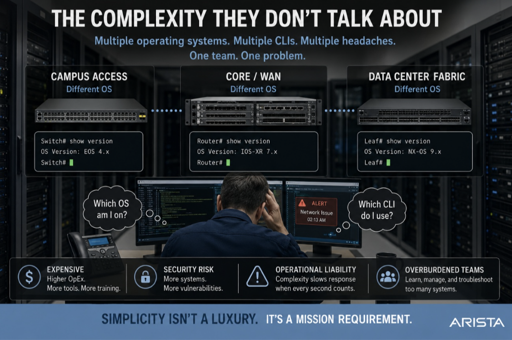
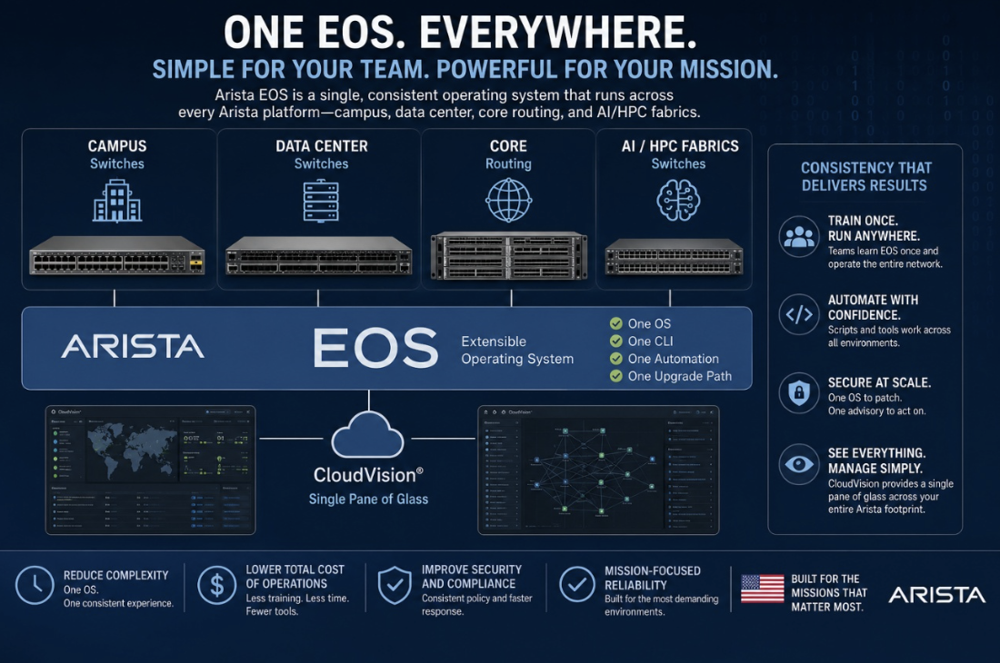
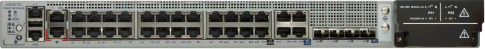
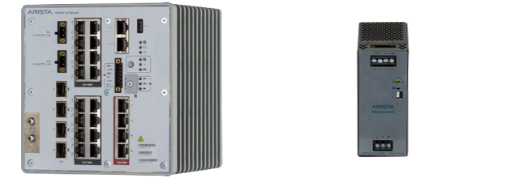

<!-- Google tag (gtag.js) -->

[![Image Placement][1]][2]
[1]: img/arista-federal-logo.png
[2]: http://www.aristafederal.com

# Welcome to the July 2026 edition of the Arista Federal Newsletter, created for our valued Federal Agency and System Integrator customers.

This month, our nation celebrated a truly historic milestone: **America's 250th Birthday**. From the incredible fireworks over our Nation's Capital and celebrations taking place across the country, Independence Day reminds us of the vision, courage, and determination that have defined the United States for two and a half centuries.
At Arista Federal, we're proud to support the federal agencies, military services, intelligence community, federal systems integrators, and industry partners who continue that legacy every day. Whether defending our nation, securing critical infrastructure, advancing scientific discovery, or delivering essential government services, these organizations rely on resilient, secure, and innovative networking to accomplish their missions.

As we celebrate America's Semiquincentennial, we're reminded that innovation has always been one of our nation's greatest strengths. That same spirit continues to drive the next generation of technology from AI-powered infrastructure and automation to secure, cloud-scale networking designed for the missions that matter most.

Although the fireworks have faded, the spirit of Independence Day continues. From all of us at **Arista Federal**, we hope you and your families had a safe, memorable, and meaningful Fourth of July.

Happy 250th Birthday, America! 🇺🇸  

"It ought to be solemnized with Pomp and Parade, with Shews, Games, Sports, Guns, Bells, Bonfires, and Illuminations from one End of this Continent to the other from this Time forward forevermore." 
John Adams' historic 1776 vision

In this month’s newsletter, you’ll find:

- **One Operating System to Run Them All: Why EOS Matters for Federal Agencies**
    Arista Federal Account Manager Heather Hogan explains why **Arista EOS** is a powerful differentiator for federal agencies facing staffing shortages, cybersecurity mandates, and increasing operational complexity.

- **Arista Introduces Ruggedized Switching**
    Arista Federal Systems Engineer Michael Harrison explores how Arista's new **Ruggedized Switching Portfolio** extends the power of EOS beyond the traditional enterprise campus to industrial facilities, outdoor deployments, tactical environments, and other mission-critical edge locations.    Arista's Ruggedized Switches are engineered to withstand extreme temperatures, vibration, and mechanical shock, delivering the same operational consistency, security, automation, and reliability that customers expect from Arista.

This newsletter is for you and we welcome your feedback, ideas, and requests at <fed@aristafederal.com>.

As always, thank you for your partnership and trust in Arista. We remain committed to helping our customers build secure, resilient, and modern network infrastructures that support mission success today and well into the future.

---

## **Arista Blog**

[![Image Placement][3]][4]
[3]: img/blog.png
[4]: https://blogs.arista.com/blog

---
## **One Operating System to Run Them All: Why EOS Matters for Federal Agencies**

By Heather Hogan, Arista Federal Account Manager

Two hundred and fifty years ago, the founders of this country made a deliberate bet — one unified
framework of governance instead of thirteen separate ones. It wasn't the easy path, but it was the right
one. The alternative was fragmentation, inconsistency, and the operational nightmare of trying to manage
systems that couldn't talk to each other.

Federal agencies are living that same challenge right now, just with network operating systems.

**Here's the problem most agencies don't talk about out loud.**

Walk into a typical federal data center or campus environment, and you'll find networking gear running
multiple operating systems, sometimes from the same vendor. A switch on the campus floor running one
OS, a core router running another, a data center fabric running a third. Each one has its own CLI, its own
upgrade path, its own quirks, its own training requirements. Your team has to become fluent in all of them.
When something breaks at 2 a.m., the person on call needs to know which system they're dealing with
before they can even start troubleshooting.

That complexity isn't just annoying. It's expensive, it's a security risk, and in a mission-critical
environment, it's a liability.

**This is exactly the problem Arista EOS was built to solve.**

EOS, or Extensible Operating System, is a single, consistent operating system that runs across every
Arista device. Campus switches, data center switches, core routing, AI/HPC fabrics: one OS, one CLI, one set of automation tools, one upgrade path. It doesn't matter if you're touching a switch at a field office in Virginia or a spine router in a DoD data center. It's the same EOS.
    
That consistency has real operational consequences. Teams that learn EOS once can operate the entire
Arista footprint. Automation scripts written for one environment work across all of them. When a security
advisory comes out, you're patching one operating system, not three. CloudVision, Arista&#39;s centralized
management platform, gives you a single pane of glass across all of it.

**Why this matters even more in federal environments.**

Federal agencies operate under intense pressure: staffing constraints, budget scrutiny, continuous ATO
cycles, and an ever-expanding threat surface. The last thing a lean IT team needs is operational
complexity that multiplies every time a new device comes online.

Arista's historically low CVE count is, in part, a direct result of maintaining one codebase. Fewer operating
systems means fewer places for vulnerabilities to hide, fewer patch cycles to manage, and a smaller
attack surface overall. For agencies navigating STIG compliance, vulnerability management, and Zero
Trust mandates, that's not a minor detail. It's a meaningful architectural advantage.

**The simple version.**

Most networking vendors ask you to learn their products. Arista asks you to learn one thing, and then that
one thing works everywhere. For a federal agency trying to do more with less, that's not just a technical
differentiator. It's an operational strategy.

If you want to see what that looks like in your environment, reach out. We're happy to walk through it.

---
## **Arista Introduces Ruggedized Switching**

By Michael Harrison, Arista Federal Systems Engineer

Arista Networks has expanded its Cognitive Campus Networking Portfolio, bringing enterprise networking to mission-critical edge environments. The new ruggedized switches are engineered to operate reliably in industrial facilities, tactical deployments, outdoor installations, and other harsh environments. Built to withstand extreme temperatures, vibration, mechanical shock, and electrical noise, and featuring an IP30-rated enclosure, these platforms extend the power of Arista EOS to locations where reliability and resilience are paramount.

**Ruggedized Campus Switches (710HXP Series) - Available now.**
- Industrial Hardware Form Factors:
    - CCS-710HXP-28TXH: Standard 1RU rack-mount platform optimized for edge enclosure placement.

1RU rack mount: Arista CCS-710HXP-28TXH-4S

    - CCS-710HXP-20TNH: Compact, ruggedized DIN rail-mount model designed for heavy machinery panels, utilities, and space-constrained enclosures.

DIN rail mount: Arista CCS-710HXP-20TNH-4S, external power supply

    - Extreme Hardening Standards:
        - Temperature Range: Operates seamlessly in non-climate-controlled environments from -40°C to 75°C.
        - Infiltration Defenses: Features an IP30-rated enclosure, protecting the circuitry against dust and solid particle entries over 2.5 mm.
        - Structural Resilience: Fully certified to withstand industrial-grade physical impact, continuous vibrations, and mechanical shock.
                                            
    - Enterprise Power Over Ethernet (PoE): 
        - Configurable with high-power PoE options offering 30W, 60W, and up to 90W per port. This allows a single switch to natively power industrial IP cameras, heavy-duty IoT gateways, and high-performance access points without requiring separate power injectors.
    - Unified Codebase Continuity: 
        - Unlike typical industrial switches that rely on stripped-down firmware, the 710HXP platforms run the exact same modular Arista EOS® codebase as the data center line. This allows enterprise network teams to seamlessly deploy identical VXLAN/EVPN segmentation, network automation hooks, and CloudVision Real-Time Telemetry APIs uniformly across the entire corporate fabric.
    - **Features: 
        - **General:** VLAN for VoIP, ZTP, eAPI, Maintenance Mode, Cognitive PoE, Universal SWI and L3 Subinterfaces.
        - **L2:** STP/RST/MST/(RPVST+), 4096 VLAN IDs, 256 active VLANs, LACP, Q-in-Q, VLAN Translation, Storm Control, Protected ports, IGMP v1/v2/v3 snooping, Loop protect and MLAG.
        - **L3:** OSPF, OSPFv3, BGP, MP-BGP, IS-IS, RIPv2, 64-way ECMP, BFD, VRRP, 8 VRFs, Route Maps, Selective Route Download and PBR.
        - **Security, Visibility, Monitoring:** Ingress RACL, ACL logging, CPP, MAC ACL, Port Security, 802.1X, MAB, Multi-Host 802.1X AUTH, Dynamic VLAN assignment, DHCP Relay, TACACS+, RADIUS, RADSEC, Ingress/Egress Mirroring, Filtered Mirroring, Remote port mirroring, sFlow, IPFIX and PTP.
        - **QoS, Load Balancing:** 8 queues per port, 802.1p based classification, DSCP based classification/remarking, QoS interface trust, Strict priority queueing, Weighted Round Robin (WRR) Scheduling, Policing/Shaping, ACL based DSCP Marking, Policing Rate Limiting, Flowcontrol Rx/Tx and PFC RX.

**Summary**

Arista Networks has launched its new 710HXP Series ruggedized switching platforms (CCS-710HXP-28TXH and CCS-710HXP-20TNH), extending their Cognitive Campus Networking Portfolio into harsh, non-climate-controlled industrial and outdoor environments. Arista is unifying IT (Information Technology) and OT (Operational Technology) networks by delivering full-scale data center software capabilities, enterprise-grade security, and high-power PoE inside hardware built to survive extreme physical environments. These platforms run the exact same modular Arista EOS codebase used on all our platforms. This simplifies Network Management, Enterprise IT teams can manage harsh edge environments using their existing data center tools, automation hooks, and CloudVision telemetry.

 

---
## __Webinars and Events__  

-   __Webinars__  

    --- 

    We make is easy for you to view products that are of interest, all virtually! Technical memebers of the team showcase outstading explanation of the products. Click below to see our list of Webinars. 

    [Arista Webinars](https://www.arista.com/en/company/news/webinars){.md-button}

-   __Events__ 

    ---
    Join us in person to get a closer look in our list of produts and solution, as well as get the chance to meet members of the team. Click below to see our list of ipcoming Events. 

    [Upcoming Events](https://www.arista.com/en/company/news/events){ .md-button }

--- 

## __*Software Updates*__

*Stay informed on the latest software updates across all Arista products and services.*

|  Software    | Version      |  Release Date |
| :-----------: | :-----------: | :-----------: |
| __EOS__           | 4.33.8M   4.22.11M   4.34.6M   4.35.4M | May 12th, 2026   May 6th, 2026   May 6th, 2026   May 23rd, 2026 |
| __CVP__           | Portal 2026.1.0   Appliance 7.1.0   Sensor 1.3.0 | March 30th, 2026   September 2nd, 2025   December 5th, 2025 |
| __DMF__           | 8.10.0 | April 22nd, 2026 |
| __CV-CUE__         | 21.0.0 | January 16th, 2026 |
| __Arista NDR__     | 5.3.5 | July 16th, 2025 |
| __TerminAttr__     | 1.42.1 | February 4th, 2026 |
| __VeloCloud SD-WAN__  Orchestrator/Gateway/Edge | 6.4.1 | December 19th, 2025 |

[View All Latest Software Updates](https://www.arista.com/en/support/software-download){: .md-button .md-button--primary target="_blank" }

---

## __* Security Advisories and Field Notices*__

*Stay informed on the latest platform security and field notice updates. For more information on Arista's statement on AI-Enhanced Security and Resilience regarding Mythos and project Glasswing, [click here.](https://www.arista.com/assets/data/pdf/glasswing/QA-Project-Mythos-Glasswing.pdf){: target="_blank" }*

### **Security Advisories**
* **Dirty Frag Vulnerability** — [Security Advisory 0138](https://www.arista.com/en/support/advisories-notices/security-advisory/24019-security-advisory-0138){: target="_blank" }   *(May 8th, 2026)*
* **Tunnel Decapsulation Configuration** — [Security Advisory 0137](https://www.arista.com/en/support/advisories-notices/security-advisory/24005-security-advisory-0137){: target="_blank" }   *(May 5th, 2026)*
* **Copy Fail Vulnerability** — [Security Advisory 0136](https://www.arista.com/en/support/advisories-notices/security-advisory/24004-security-advisory-0136){: target="_blank" }   *(May 1st, 2026)*

### **Field Notices**
* **CloudEOS Pay As You Go** — [Field Notice 0128](https://www.arista.com/en/support/advisories-notices/field-notice/24021-field-notice-0128){: target="_blank" }   *(May 11th, 2026)*
* **Default Option Change in the Access Point Upgrade Feature in CV-CUE** — [Field Notice 0127](https://www.arista.com/en/support/advisories-notices/field-notice/24016-field-notice-0127){: target="_blank" }   *(May 5th, 2026)*
* **TerminAttr** — [Field Notice 0126](https://www.arista.com/en/support/advisories-notices/field-notice/24003-field-notice-0126){: target="_blank" }   *(May 4th, 2026)*

 

[View All Latest Advisories & Notices](https://www.arista.com/en/support/advisories-notices){: .md-button .md-button--primary target="_blank" }

---

## __* Product Updates*__

*Stay up to date on all new Arista Product Releases, as well as End of Sale/End of Support Notices.*

### **New Product Releases** * **Q1 2026** — [Ask AVA - CloudVision as a Service (beta feature)](https://www.arista.io/help/articles/overview-core-tools-ask-ava){: target="_blank" }

###  **End of Sale / End of Software Support**
* **May 15th, 2026** — [VeloCloud Security VNF Services](https://www.arista.com/en/support/advisories-notices/end-of-support/24027-end-of-availability-for-velocloud-security-vnf-services){: target="_blank" } 

 

[View All Latest End of Sale & Support Notices](https://www.arista.com/en/support/advisories-notices/endofsale){: .md-button .md-button--primary target="_blank" }

---

## Did You Know? 
Arista has revamped their certifications! The new **Arista Certified Engineer (ACE)** program is now organized by specific tracks like Cloud Data Center, Campus, and Automation to better align with your job role.

[Start your ACE journey now](https://www.training.arista.com/){ .md-button .md-button--primary target="_blank" }

---
# *Feel Free to Reach Out To Us For Your Network Needs* 
<figure markdown>
{: style="height:300px;width:800px"}  
    <figcaption></figcaption>
</figure>
We thank you for taking the time to read out newsletter today. Feel free to reach out to your SE or ASE for more information or questions regardsing your network operations. Until next month, have a good one! 