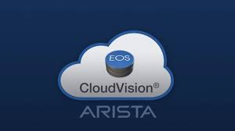
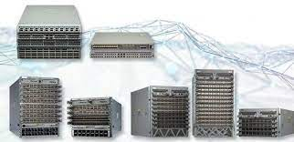

<!-- Google tag (gtag.js) -->

[![Image Placement][1]][2]
[1]: img/arista-federal-logo.png
[2]: http://www.aristafederal.com

# Welcome to the March 2026 Edition of the Arista Federal Newsletter!
As we celebrate St. Patrick’s Day on March 17th and the wearing of the green, it’s a good reminder that while a little luck is always welcome, success in today’s mission-critical environments depends on preparation, performance, and the right technology foundation. As Federal agencies and System Integrators continue advancing initiatives around automation, AI, and secure infrastructure, the network plays an increasingly strategic role.

At Arista, we focus on delivering the performance, reliability, and operational simplicity needed to support these evolving mission requirements. Our consistent architecture helps organizations scale with confidence, reduce complexity, lower operational costs, and keep their networks running smoothly—no four-leaf clover required.

☘️ May your networks run smoothly, your missions succeed, and a little luck of the Irish follow you along the way.  Sláinte ☘️

In this month’s newsletter, you’ll find:

- **Maximize Your Arista Investment with the Arista Training Academy**
    Arista Federal Client Director John Corlett explains how the Arista Training Academy equips network engineers with the hands-on skills needed to fully leverage Arista technologies. Discover how the new All-Access Training Pass provides flexible training and certification to help teams build real-world expertise across modern network environments.

- **Modernizing Campus Networks with Arista SWAG**
    Arista Systems Engineer Michael Harrison explains how Arista Switch Aggregation Group (SWAG) redefines traditional campus stacking by using standard Ethernet to simplify management, improve resiliency, and scale campus networks far beyond legacy limitations. Learn how SWAG enables organizations to modernize their campus architecture while reducing complexity and operational overhead.

This newsletter is for you and we welcome your feedback, ideas, and requests at <fed@aristafederal.com>.

Thank you for reading the Arista Federal Newsletter — your go-to source for the latest innovations, industry insights, and mission-focused networking solutions for Federal Agencies and System Integrators.

---

## **Arista Blog**

[![Image Placement][3]][4]
[3]: img/blog.png
[4]: https://blogs.arista.com/blog

---

## **Maximize Your Arista Investment with the Arista Training Academy**

By: John Corlett, Arista Federal Client Director

You’ve invested in Arista networking so now empower your team to get the most from it. Maximizing the
value of your network means ensuring your engineers have the skills needed to fully leverage their
capabilities. Whether you’re onboarding a new network engineer or helping experienced engineers
deepen their expertise with Arista technologies, the Arista Training Academy provides the resources to
help your team succeed through structured learning tracks, hands-on labs, and practical certification
exams.

The Arista Training Academy offers a fast, flexible way for network engineers to build real-world expertise
across campus, data center, automation, AI, and cloud networking.

To make training even more accessible, Arista has introduced the All-Access Training Pass. For $4,995,
organizations receive one year of unlimited access to the full Arista training catalog, covering a wide range
of real-world networking technologies and operational workflows.

The All-Access Pass also includes 40 hours of hands-on lab time per track, allowing engineers to practice
deployments and operational workflows in realistic environments. In addition, the pass includes one
certification exam attempt, which can be used toward any Arista Associate or Specialist certification.
These exams focus on validating real-world operational knowledge rather than memorization. They are
open book and do not require travel to a testing center, making certification both flexible and accessible.

To learn more about the Arista Training Academy and the All-Access Training Pass,
visit: <https://www.training.arista.com/>

![Image Placement][5]
[5]: img/mar26_pic5.png

![Image Placement][6]
[6]: img/mar26_pic6.png

![Image Placement][7]
[7]: img/mar26_pic7.png

![Image Placement][8]
[8]: img/mar26_pic8.png

---
## **Modernizing Campus Networks with Arista SWAG**

By: Michael Harrison, Arista Systems Engineer

**Overview**

Traditional switch stacking has long been a bottleneck for campus networks, characterized by proprietary hardware, limited scale, and rigid physical constraints. Arista **Switch Aggregation Group (SWAG)** redefines this model by leveraging standard Ethernet to group currently supporting 16 switches under a single management IP, theoretically up to **48 switches** in future releases. 

**Strategic Value**

- **Operational Simplicity**: Manage dozens of switches as a single virtual chassis through a single CLI and IP address, significantly reducing administrative overhead.

- **Cost Reduction**: Conserve scarce IP addresses and potentially reduce licensing costs for third-party tools that charge per managed endpoint.

- **Architectural Freedom**: Break free from "closet-bound" stacking. SWAG allows switches to be distributed across floors or buildings using standard fiber optics.

- **Enhanced Resiliency**: Unlike legacy stacks where a single software failure can crash the entire group, SWAG utilizes Arista EOS’s modular architecture to provide hitless upgrades and superior fault isolation.
 

**Transitioning from Legacy Stacking to Arista SWAG**

**1. The Limitations of Legacy Stacking**

For decades, campus networks relied on "stacking" to simplify management. However, this came at a high technical cost:

- **Proprietary Lock-in**: Special stacking cables and modules increased CAPEX and limited physical distance to a few meters.

- **Brittle Control Planes**: Many legacy stacks share a single control plane (fate-sharing), meaning a bug on one switch often downs the entire stack.

- **Scalability Caps**: Most vendors cap stacks at 8–12 switches, forcing net-admins to manage dozens of separate stacks in large buildings.

![Image Placement][9]
[9]: img/mar26_pic9.png 

**2. Technical Architecture of Arista SWAG**

Arista SWAG (Switch Aggregation Group) implements a "virtual chassis" model using standard Ethernet as the backplane.

- **Standard Interconnects**: SWAG uses standard front-panel ports (1G to 100G) and optics, allowing for campus-wide distribution.

- **Role-Based Hierarchy**: A SWAG cluster consists of two Supervisors (Active/Standby) and multiple Worker nodes. This mirrors the architecture of a high-end modular chassis like the Arista 7500 series.

- **Topology Versatility**: While legacy stacks are limited to rings or chains, SWAG supports modern Leaf-Spine (LSS) designs, providing higher bandwidth and better redundancy.

![Image Placement][10]
[10]: img/mar26_pic10.png 

 
**3. Operational Advantages**

|Capability|Impact of Arista SWAG|
| :-----------: |:-------------: | 
|Scale| Scales to 48 members, 4x more than leading legacy alternatives.|
|Upgrades|Supports Smart System Upgrades (SSU) for hitless maintenance.|
|Management|Centralized via CloudVision, offering real-time telemetry and AI-driven insights.|
|Flexibility|Decouples management from physical proximity; switches can be anywhere a fiber reaches.|

**4. Conclusion: The Path Forward**

Arista SWAG allows organizations to migrate gracefully from legacy environments. By adopting an Ethernet-based, software-defined stacking model, enterprises can eliminate proprietary hardware costs, simplify their IP management, and build a campus network that matches the resiliency of a modern data center.

---

## __*2026 Webinar Series — Coming Soon*__

Our 2026 webinar schedule will be announced shortly, and we look forward to your participation in another year of insightful and informative sessions. In the meantime, we invite you to explore the recordings from our 2025 webinar series featuring valuable discussions, technical deep dives, and best practices across key networking topics.

2025 Webinar replays are available here: 

<https://www.carahsoft.com/content-hubs/arista-networks-resources/federal-IT-modernization-webinar-series>

Stay tuned for more details, and we hope you’ll join us for the upcoming 2026 sessions.

<https://www.carahsoft.com/content-hubs/arista-networks-resources/federal-IT-modernization-webinar-series>

-   __Arista Network Webinars Series with Carahsoft__

    __For Channel Partners Only__

    [![Image Placement][20]][21]
    [20]: img/arista-carasoft-v2.png
    [21]: https://carahevents.carahsoft.com/Event/Details/618442-arista-networks

    |  Date | Name| Description | 
    | :-----------: | :-----------: | :-----------: |
    | __TBD__ | TBD | TBD |

    [Register Here](https://carahevents.carahsoft.com/Event/Details/618442-arista-networks){.md-button}

-   __Webinars__  

    --- 

    We make is easy for you to view products that are of interest, all virtually! Technical memebers of the team showcase outstading explanation of the products. Click below to see our list of Webinars. 

    [Arista Webinars](https://www.arista.com/en/company/news/webinars){.md-button}

-   __Events__ 

    ---
    Join us in person to get a closer look in our list of produts and solution, as well as get the chance to meet members of the team. Click below to see our list of ipcoming Events. 

    [Upcoming Events](https://www.arista.com/en/company/news/events){ .md-button }

--- 
## __*Software Updates*__
<figure markdown>
{: style="height:200px;width:300px"}    
    <figcaption></figcaption>
</figure>
For new code releases, click [here](https://www.arista.com/en/support/software-download) 

   |  Softwares    | Versions      |  Release Date |
   | :-----------: | :-----------: | :-----------:
   | __EOS__           | 4.34.3.1M  4.32.8M   4.34.3M   4.35.0F    | November 4th, 2025  October 27th, 2025   October 6th, 2025   October 6th, 2025   
   | __CVP__           | Portal 2025.2.1   Appliance 7.0.1   Sensor 1.2.0      | August 21st, 2025   January 28th, 2025  September 8th, 2025  
   | __DMF__           | 8.8.0  | August 15th, 2025   
   | __WLAN__  CV-CUE  |   19.0.0        |   July 25th, 2025   
   | __Arista NDR__         | 5.3.5         | July 16th, 2025
   | __TerminAttr__    | 1.39.1         | July 18th, 2025    
   | __VeloCloud SD-WAN__   Orchestrator/ Gateway / Edge   |  6.4.0         |   May 2nd, 2025   

---

## __*Software Advisories*__
Below is a list of advisories that are announced by Arista. To view more details on the specific advisories, please click the links in the middle row.

| Name          | Advisory Link           | Date of Advisory Notice  |
| :-----------: |:-------------:| :-----:|
|  __Arista DANZ Monitoring Fabric__   | [Security Advisory 0124](https://www.arista.com/en/support/advisories-notices/security-advisory/22538-security-advisory-0124)  | October 22nd, 2025   |  
|  __Arista Edge Threat Management NGFW__   | [Security Advisory 0123](https://www.arista.com/en/support/advisories-notices/security-advisory/22535-security-advisory-0123)  | October 21st, 2025   |  
|  __WiFi 7 Access Points Firmware Version 21.0__   | [Field Notice 0117](https://www.arista.com/en/support/advisories-notices/field-notice/22534-field-notice-0117)  | October 16th, 2025   |  
|  __SwitchApp Interfaces starting with EOS 4.35.0F__   | [Field Notice 0116](https://www.arista.com/en/support/advisories-notices/field-notice/22528-field-notice-0116)  | October 14th, 2025   |  

 

For a list of the most current advisories and notices, click [Here](https://www.arista.com/en/support/advisories-notices)

---

## __*Product Updates*__
<figure markdown>
{: style="height:200px;width:400px"}   
    <figcaption></figcaption>
</figure>
**End of Sale** notices are listed below.

| Device        | Name           | End Of Sale Date  |
| :-----------: |:-------------: |     :----:        |
| Software      | [End of Software for CloudVision Portal 2023.2](https://www.arista.com/en/support/advisories-notices/end-of-support/21412-end-of-software-support-for-cloudvision-portal-2023-2-release-train) [End of Software Support for EOS 4.28](https://www.arista.com/en/support/advisories-notices/end-of-support/21275-end-of-software-support-for-eos-4-28) [DMF and CCF Deployments on Accton/ Edgecore Switches](https://www.arista.com/en/support/advisories-notices/end-of-support/21094-end-of-support-for-dmf-and-ccf-deployments-on-accton-edgecore-switches) [EOS-4.34 and later no longer supported on select switches](https://www.arista.com/en/support/advisories-notices/end-of-support/21089-end-of-software-support-for-7280r-r2-7500r-r2-and-7020r-series)  | May 27th. 2025   March 14, 2025  January 31st, 2025  January 15th, 2025   |
| CVP           | [CVP IPAM Application](https://www.arista.com/en/support/advisories-notices/endofsupport)   [CVP 2023.3](https://www.arista.com/en/support/advisories-notices/end-of-support/21627-end-of-software-support-for-cloudvision-portal-2023-3-release-train)          |  July 14th, 2025   June 17th, 2025   |
| DMF           | [DMF Service Node DCA-DM-SC2](https://www.arista.com/en/support/advisories-notices/end-of-sale/22537-end-of-sale-end-of-life-for-arista-service-node-appliance-dca-dm-sc2)          |  October 22nd, 2025           |  
| CCF           | [CCF Product Line](https://www.arista.com/en/support/advisories-notices/end-of-sale/22430-end-of-sale-end-of-life-for-arista-ccf-product-line)          |  October 1st, 2025           |  
| Switches      | [7010TX-48-DC Switch](https://www.arista.com/en/support/advisories-notices/end-of-sale/22421-end-of-sale-of-the-arista-7010tx-48-dc-switches)  [7050CX3-32S Switch](https://www.arista.com/en/support/advisories-notices/end-of-sale/22419-end-of-sale-of-the-arista-7050cx3-32s-switches)  [CCS-720XP-96ZC2 Switch with 4GB DRAM](https://www.arista.com/en/support/advisories-notices/end-of-sale/22403-end-of-sale-of-the-arista-ccs-720xp-96zc2-switches-with-4gb-dram)  [CCS-720D Switches with 4GB DRAM](https://www.arista.com/en/support/advisories-notices/end-of-sale/22402-end-of-sale-of-the-arista-ccs-720d-switches-with-4gb-dram)  [CCS-710P-12 Switch](https://www.arista.com/en/support/advisories-notices/end-of-sale/22401-end-of-sale-of-the-arista-ccs-710p-12-switch) |  September 19th, 2025  September 19th, 2025  Septemebr 12th, 2025  September 12th, 2025  September 12th, 2025 |
| Access Points      | [AP Mounts](https://www.arista.com/en/support/advisories-notices/end-of-sale/22536-end-of-sale-of-ap-mounts-mnt-ap-flat-c130-mnt-ap-flat-c100-mnt-ap-flat-14cm-a)  |  October 22nd, 2025   | 
| VeloCloud      | [SASE Secured by Symantec](https://www.arista.com/en/support/advisories-notices/end-of-sale/22072-end-of-sale-life-velocloud-sase-secured-symantec)  [Software Defined (SD) Access](https://www.arista.com/en/support/advisories-notices/end-of-sale/21653-end-of-sale-end-of-life-for-velocloud-software-defined-sd-access)   |  August 20th, 2024   July 1st, 2025 | 

**New Releases** of Arista's device are listed below 

|  Device       | More Information |  Release Date 
    | :-----------: | :-----------:    | :-----------:
    | Arista VeloCloud | [VeloCloud Acquisition](https://www.arista.com/en/company/news/press-release/21646-pr-07012025) | Q3 2025
    |  Arista SWAG    |   [Modern Stacking for Campus](https://www.arista.com/en/company/news/press-release/20693-pr-12032024)                | Q1 2025 
    | Arista Multi-Domain Segmentaton Service  | [Arista MSS](https://www.arista.com/en/company/news/press-release/19297-pr-20240430)         | Q3 2024
    | Arista CV UNO  | [CloudVision Universal Network Observability](https://www.arista.com/en/company/news/press-release/19195-pr-20240305)  | Q1 2024

---
# *Feel Free to Reach Out To Us For Your Network Needs* 
<figure markdown>
{: style="height:300px;width:800px"}  
    <figcaption></figcaption>
</figure>
We thank you for taking the time to read out newsletter today. Feel free to reach out to your SE or ASE for more information or questions regardsing your network operations. Until next month, have a good one! 