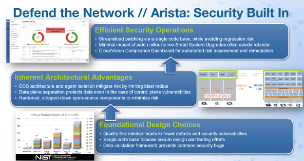
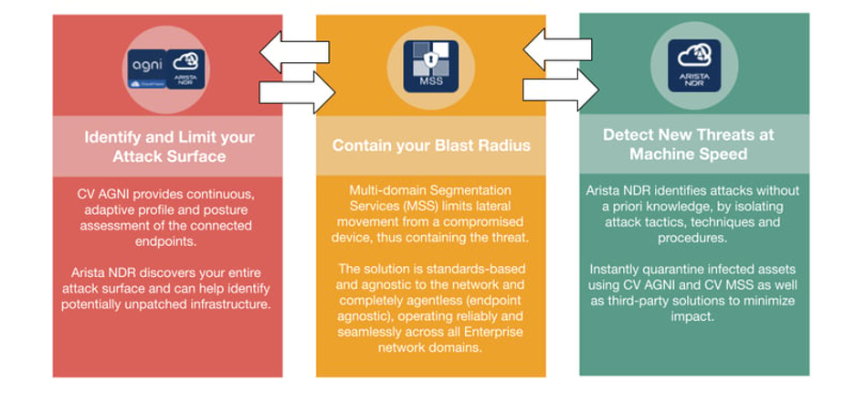
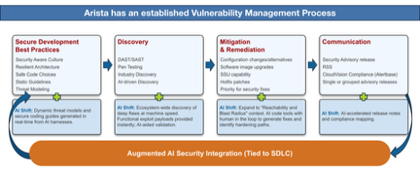
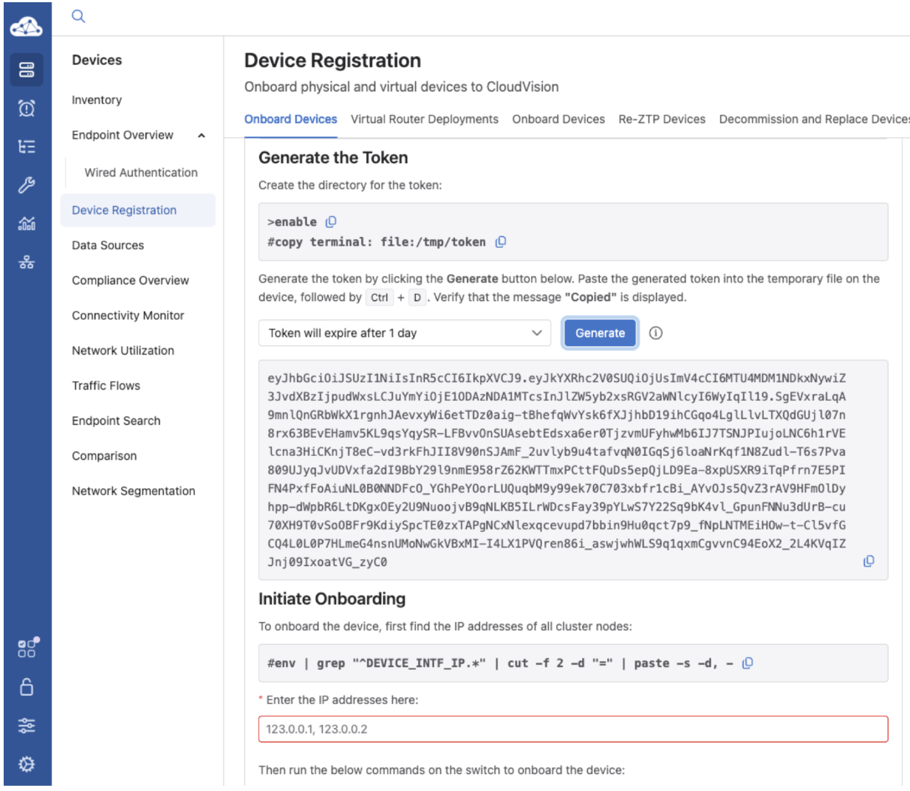
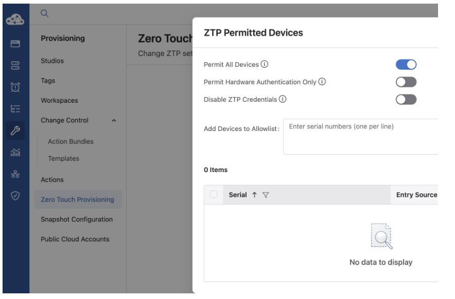

<!-- Google tag (gtag.js) -->
<script async src="https://www.googletagmanager.com/gtag/js?id=G-74HMNYLH82"></script>
<script>
  window.dataLayer = window.dataLayer || [];
  function gtag(){dataLayer.push(arguments);}
  gtag('js', new Date());
  gtag('config', 'G-74HMNYLH82');

</script>

[![Image Placement][1]][2]
[1]: img/arista-federal-logo.png
[2]: http://www.aristafederal.com

# Remembering September 11 — 25 Years Later

As we share the September edition of the Arista Federal Newsletter, we do so with a profound sense of remembrance and reflection. This year marks the 25th anniversary of September 11, 2001 — a day that forever changed our nation and the lives of so many Americans.
Twenty-five years later, the memories remain vivid. For many of us, it is one of those moments in history when we can still remember exactly where we were and what we were doing as the events of that morning unfolded.

We remember the nearly 3,000 souls who lost their lives that day, the heartbreaking final calls to loved ones, and the extraordinary courage of the passengers and crew of United Flight 93, who chose to fight back against the hijackers despite knowing the tremendous risk they faced.

We remember the firefighters, police officers, EMTs, first responders, members of our military and intelligence community, and everyday Americans who stepped forward during our nation's darkest hours. Their courage, sacrifice, and commitment to one another demonstrated the very best of America.

We also recognize that the impact of September 11 did not end that day. Over 9,000 first responders, recovery workers, survivors, and others have since lost their lives to 9/11-related illnesses, while many more continue to live with the physical and emotional effects today.

For those of us who have the privilege of working with and supporting the Federal, Defense, Intelligence, and National Security communities, this anniversary carries special meaning. We see firsthand the dedication of the men and women whose mission is to protect our country, our critical infrastructure, and the freedoms we enjoy every day. We are grateful for their service and proud to support their missions.

Twenty-five years later, may we never forget not only the tragedy and those we lost, but also the strength, compassion, resilience, and unity that brought our country together in the days that followed.

May we continue to honor their memory through service, gratitude, and a shared commitment to protecting the nation they loved.

**We remember. We honor. We will never forget.**

In this month’s newsletter, you’ll find:

- **Racing Against Machine-Speed Threats: How Arista Is Using AI**

    In this important Arista blog article, Ken Duda (Arista Founder, President and CTO) and Jason Bevis (Arista VP and CISO) discuss how AI is accelerating both vulnerability discovery and the speed of cyber threats and how Arista is harnessing that same technology to strengthen our defenses. By integrating advanced AI capabilities throughout our software development and security processes, Arista is working to identify vulnerabilities earlier, respond faster, and build even greater resilience into EOS and our customers’ networks.

- **Zero Touch Provisioning with Arista — Part Two: Environment Setup & Execution**

    In Part Two of our Zero Touch Provisioning (ZTP) series, Arista Federal's Casey Durst (SE) and Brady Schulman (ASE) move from the “why” to the “how.” This installment provides a practical look at setting up the ZTP environment, securely onboarding switches through Arista CloudVision, troubleshooting deployment, and simplifying device replacement all designed to make network deployment faster, more consistent, and easier to execute in the field.


We welcome your feedback, ideas, and requests for this newsletter at <fed@aristafederal.com.>

As always, thank you for your partnership and trust in Arista. We remain committed to helping our customers build secure, resilient, and modern network infrastructures that support mission success today and well into the future.

---

## **Arista Blog**

[![Image Placement][3]][4]
[3]: img/blog.png
[4]: https://blogs.arista.com/blog

---
##Racing Against Machine-Speed Threats: How Arista Is Using AI##
By Ken Duda (Arista Founder, President and CTO) and Jason Bevis (Arista VP and CISO) 
 


Two decades into our journey, quality remains Arista's absolute top priority: networking you can count on. Thus, product security is a first principle, not an afterthought. The threat landscape we're operating in today is changing faster than at any point in our history, and we want to talk directly to our customers about how we're responding and about a few things you should expect from us over the weeks and months ahead.

Using AI within our software development lifecycle, as well as in our security programs, is not new to us, including for discovering vulnerabilities and testing our software before release. Over the past few months, we've been collaborating with Anthropic, Google, OpenAI, and others to integrate new AI-enabled security capabilities from foundation models into our existing software security pipeline. Through access to models such as Mythos and Daybreak and being invited early as a key infrastructure supplier into partnerships like Project Glasswing, we've been layering AI-driven vulnerability discovery and assessment onto our established security [vulnerability management process.](https://www.arista.com/en/support/product-documentation/vulnerability-management-process) The result is a more thorough security review process operating at a much faster machine pace. We've been using this capability proactively to find vulnerabilities in our own software before anyone else does.

That work has paid off, and we have already released several of these fixes. Next week, we will publish a batch of security advisories covering several issues along with detailed remediation guidance for each. We're [pre-announcing this,](https://www.arista.com/en/support/advisories-notices/security-advisory/24535-security-advisory-0148) ahead of the detailed disclosures, so your teams have a heads-up. For at least the next few months, while we address the issues discovered with these new tools, we expect an elevated volume of security advisories and batched releases. We know that a predictable rhythm is easier to plan around, staff for, and roll into existing change-control processes than advisories that show up piecemeal with no warning.

**We Say This With Real Empathy**

We're heading into a period when frontier AI can find and weaponize software flaws in minutes rather than months. That capability cuts both ways: it's why our AI-enabled security efforts work, and it's also why the volume of vulnerabilities disclosed across the application and infrastructure software industries worldwide is set to spike, and “patch-and-pray” was never a strategy built for this pace.

The people on the front lines of this fight are already stretched thin, fielding advisories from dozens of vendors, triaging what actually matters to their environment, and finding maintenance windows in networks that were never supposed to go down. They deserve better tools and a better architecture to work from, and that is our ongoing commitment to you: not just more security advisories, but security advisories delivered in a way you can actually plan around, backed by architectural advantages we've spent two decades building into Arista EOS and capabilities designed to limit how much damage any particular vulnerability can cause.

**The Arista Architectural Advantage**

We think about defense in two complementary layers: defending the network itself and defending the rest of your infrastructure with the network. Both matter, and both are more relevant than ever in an AI-accelerated threat environment.

**Defend the Network**

Historically, customers have labored through the legacy vendor experience where a “software upgrade” was often a greater business risk than living with bugs, old features, and even security issues in the deployed code! If this seems backward, it is! All too often, when customers replace one of these legacy vendors with Arista, we find them running old and even unsupported software trains, afraid of what might break if they touch the network OS. From a security perspective, this, of course, means they continue to operate with the risk posed by these unpatched bugs and vulnerabilities.

Of course, as we jump into this new world where software updates are even more frequent, operators need to trust the underlying software enough to upgrade quickly to the latest version without fear of something breaking on the network. That trust depends on three requirements: finding ways to qualify new software faster, running a genuinely modern operating model that lets you upgrade quickly and without interruption, and having real confidence that your network operating system delivers the highest quality in every release.
 


At Arista, our best customer experience is delivered in our latest software. Not only is it the highest quality, but it also offers customers access to the latest technology, capabilities, and economics. We deliver that value based on a strong architectural foundation that includes:

- **A single high-quality operating system.** Arista has invested heavily to ensure our platforms run the same codebase. This means all of our testing, all of our red-teaming, and now all of our AI-assisted review efforts concentrate on a single target rather than being spread thin and diluted across a fragmented product line or divergent code branches. That discipline is what lets us stand behind a simple promise: the newest EOS release is also the highest-quality release, so you can move to it with confidence instead of waiting it out. We believe this is a significant reason Arista has maintained one of the lowest CVE counts in the industry over the last two decades.
- **Limiting vulnerability impact through control-plane and data-plane separation.** EOS keeps software management and hardware forwarding architecturally separate, so a failure or exploit in the control plane does not translate into a failure of the data plane. Traffic continues to flow even if there is a defect in the control plane.
- **A seamless and modern upgrade process.** Within EOS, individual software agents are isolated from one another. An issue affecting one protocol agent stays contained to that agent rather than spreading through the system. This means that we can ship a targeted fix to the affected component and deliver it via our Smart System Upgrade (SSU). This capability installs the fix and minimizes network disruption. That combination, isolated fixes plus fast, non-disruptive upgrades, is what turns "patch available" into "patched" without a maintenance window standing in the way.
- **A compliance dashboard to streamline staying up to date.** When a security advisory lands, CloudVision helps you immediately see the affected parts of your infrastructure and the release with the resolution. It also provides an automated workflow to manage change control for rolling out the fix. This real-time visibility turns a stressful advisory day into a manageable one.

While the industry as a whole will see an increase in the absolute number of security advisories, we do believe that our architectural advantages enable us to have an order-of-magnitude fewer. Just as importantly, the risk and impact of individual advisories will also be lower due to the preemptive mitigations we have in place. And finally, the process of upgrading to the latest version will remain as efficient and streamlined as possible.

**Defend With the Network**

The same architectural thinking extends beyond EOS itself. The network is one of the few places in your environment that sees everything, every user, every device, every workload, every flow, which is exactly why it belongs at the center of a zero trust strategy rather than bolted on at the perimeter. As we've laid out in more depth on our [Zero Trust Networking solutions page,](https://www.arista.com/en/solutions/security) Arista's approach maps directly to the functions the CISA Zero Trust Maturity Model calls for: segmentation, traffic management, encryption, resilience, visibility, automation, and governance, delivered as one integrated architecture instead of a stack of disconnected point products. We organize that architecture around three jobs the network must perform for you every day.




Taken together, this is what we mean by architectural resilience: an approach in which, even if a vulnerability exists, its blast radius is small, its impact is contained, and you have the tools to identify, prioritize, and remediate it on your own schedule rather than in a panic.

**The Broader Role of AI for Software Security**

It would be a mistake, though, for anyone, us included, to think about AI in security purely as a vulnerability-discovery story. While headline-grabbing zero-days get the attention, discovery alone is not where the most important defensive work happens.

The real transformation happens when organizations embed domain-specific AI harnesses directly across the entire software development lifecycle (SDLC). By using a dedicated, model-agnostic harness with the same class of models we use to find flaws, as AI tooling across our products, we can enhance our development processes. For instance, not all vulnerabilities are created equally. By using dedicated shared libraries and harnesses for threat modeling, generating dynamic secure coding docs, and spinning up AI proof-of-concept code to validate reachability and exploitability, we stress-test our architecture before code is released. To keep this scalable across all products, we’ve implemented cost-validation structures in our harnesses, optimizing token efficiency and reducing false positives through internal feedback loops. Even though AI is important at the heart of these practices, AI with a human-in-the-loop can help us ensure AI implements controls that mitigate and remediate flaws safely and effectively.

**New AI Enhanced Vulnerability Management**
 


Working at the frontier with these model providers, where the restrictions have been removed, allows us to move beyond basic prompting. By leveraging agentic loops and graph-based AI frameworks, our security testing maps complex control flows and systemic dependencies that traditional static analysis misses. Shifting these advanced AI tactics left allows us to intercept flaws during initial design and code creation, cutting vulnerability debt at the source.

This proactive stance and leveraging state-of-the-art coding practices in alignment with security testing and prevention are critical. As attackers increasingly weaponize performant open-weight models, defensive speeds must outpace adversary adaptation. We are meeting that threat by scaling AI directly into specialized operational domains such as OS hardening, mapping code changes against strict compliance and regulatory frameworks, and feeding incident telemetry back into our harness testing to instantly identify, patch, and validate flaws in similar code paths.

Our view is that the vendors and security teams who benefit most from this next wave of AI will be those who use AI across the entire lifecycle, discovery, prioritization, containment, and response, while keeping the underlying architecture resilient enough that no single finding becomes a crisis. That's the foundation we're building on with an enhanced software development lifecycle, and it's the framework we'd encourage you to hold your other vendors to as well.

**What Happens Next**

To be direct about what to expect: over the coming week, watch for a first batch of security advisories from Arista, each with a software fix and remediation guidance included. We encourage you to make sure you're subscribed to our [security advisories now,](https://www.arista.com/en/support/advisories-notices) so nothing lands in your inbox as a surprise, and to use CloudVision's Compliance Dashboard to get ahead on triage as soon as the advisories are live.

We know asking security teams to prepare for “more advisories, but on a schedule” is an unusual thing to pre-announce. We're doing it because we'd rather you hear it from us, with time to plan, than discover it the hard way. That's the partnership we're aiming for as this next era of AI-accelerated security unfolds, and we'll keep talking to you openly as it does.

References

- [Arista's Statement on AI-Enhanced Security and Resilience](https://www.arista.com/assets/data/pdf/glasswing/QA-Project-Mythos-Glasswing.pdf)
- [Arista Vulnerability Management Policy](https://www.arista.com/en/support/product-documentation/vulnerability-management-process)
- [Webinar with Arista, Anthropic, and Palo Alto Networks: Defending the Keys to the Kingdom](https://www.arista.com/en/24739-keys-to-the-kingdom-webinar) – Reply from Sept 9, 2026 Webinar
- [Arista Zero Trust Networking Solutions](https://www.arista.com/en/solutions/security)
- [Arista Security Advisories](https://www.arista.com/en/support/advisories-notices)

---
##Zero Touch Provisioning with Arista##
**Part Two: Environment Setup & Execution**

By Casey Durst (SE) and Brady Schulman (ASE)

In Part One, we covered the "why" of ZTP and laid out the minimum bar you need to clear before a device will even attempt to provision itself: EOS and CVP version minimums, a single cable to a single port and a DHCP server handing out the right options. Now it's time to actually build that environment, walk through what's happening on the wire when a switch boots for the first time and cover the day-two operational questions that always come up: how do I pull a device out of ZTP? How do I put it back in ZTP? Is it ready for configurations? Focusing again on that young Marine, Sailor, or Soldier we will walk through these steps to ensure any level of expertise can execute ZTP. 
 
**Setting Up the Environment**
 
ZTP is measurably simplified by the use of DHCP. Remember, the switch has no configuration, no IP address, and no idea where CVP lives until DHCP tells it. At a minimum, your scope needs to hand out a routable address, a default gateway that can reach CVP and NTP, and Option 67 pointing to the CVP bootstrap script. A synchronized device clock is necessary to ensure proper enrollment of SSL certificates.  DNS is optional and only required if the bootfile-name field will reference the CVP server by hostname instead of IP address. 
 
Here's a sample scope using ISC DHCP (`dhcpd.conf`) for a subnet dedicated to ZTP:
 
```
subnet 10.10.50.0 netmask 255.255.255.0 {
  range 10.10.50.100 10.10.50.200;
  option routers 10.10.50.1;
  option domain-name-servers 10.10.50.5;
  option domain-name "corp.local";
  option ntp-servers 10.10.50.6;
  option bootfile-name "https://cvp.corp.local/ztp/bootstrap";
  default-lease-time 600;
  max-lease-time 600;
}
```

A few things worth calling out:

- Bootfile-name (Option 67) is the one field that can be challenging. It must be the full URL to the CVP bootstrap endpoint, not a filename on a TFTP server like the old-school PXE days. Arista's ZTP process expects HTTPS. The /ztp/bootstrap location is built into CVP and used for all ZTP devices. It does not need to be customized per device.

- Short lease times are intentional here. During ZTP, the switch is going to reboot itself at least once after it pulls its real configuration and you don't want it holding onto a ZTP-scope lease longer than necessary once it's a production device on a different VLAN.

- If your DHCP server is a dedicated appliance (Infoblox, Windows DHCP, etc.), the concepts map directly. You will just configure Option 67 and the standard options through a different interface.
 
**CloudVision Portal: Onboarding Token and Permitted Devices**
 
While this series focuses on ZTP, if you are manually uploading a device into CVP you must generate an onboarding token and input it into the device which will authorize the device to connect to CVP; the same token may be used for multiple devices. ZTP does this check with the factory certificate so you do not need to do this manually.

1.     The Onboarding Token. This is what authenticates a device's request as coming from a legitimate source rather than an arbitrary box someone plugged into your network. Generate this under CVP's device onboarding settings and it gets referenced automatically as part of the bootstrap process. You won't type it in manually on the switch.



2.     ZTP Permitted Devices. By default, CVP will be open to all devices. This does provide ease and speed of deployment but does come at a small security risk. A best-practice would be to disable the “Permit all Devices” (see below) toggle and then build your permitted devices list. This is your allow-list within CVP, by serial number and it's the actual gatekeeper. Even with a correct DHCP scope and a reachable CVP, a device whose serial number isn't on this list will check in, get rejected, and sit there rather than being added to inventory. This is by design to ensure a rogue or misplaced switch showing up on your network doesn't silently provision itself into production.


 
Populate this list ahead of a deployment window using the serial numbers from your purchase order or asset list, not after the device shows up at the loading dock. Nothing stops a "just works" process faster than a field engineer standing in front of a rack waiting on someone in the NOC to add a serial number.
 
**How ZTP Talks to CloudVision**

Understanding this handshake step by step is worth your time because it makes troubleshooting a stalled ZTP process far less mysterious.

- Boot and discovery. A factory-default (or wiped) switch boots with ZTP enabled by default and immediately sends a DHCP discover out every connected interface, both management and data plane alike, until it gets a response.

- DHCP offer. The DHCP server responds with an IP, gateway, NTP, DNS, and Option 67 pointing to the CVP bootstrap URL.

- Bootstrap retrieval. The switch reaches out over HTTPS to that URL and downloads the bootstrap script from CVP.

- Compliance check. The bootstrap script, running with the factory hardware  token, authenticates the hardware and request. CVP checks the switch's serial number against the ZTP Permitted Devices list. 

- Inventory addition and initial configuration. CVP accepts the device and adds it to its inventory. At this point, the device is available for provisioning using standard CVP management workflows. An administrator then assigns the device to the appropriate CVP Container/Network and applies the device's intended configuration using CVP Studios. As part of the CVP-provided configuration, a startup configuration is created for the switch. 

- Configuration apply and reboot. The administrator creates and executes a Change Control that pushes the configuration to the switch. After the configuration is successfully applied, a valid startup configuration exists and ZTP is disabled; it is now a fully provisioned, CVP-managed device.The switch applies the configuration, including a full reboot.

- Steady state. Once up, the switch is a fully managed CVP device that is visible in inventory, subject to Change Control for any future changes, and streaming state back to CVP continuously.

- If a device isn't showing up, work backward through this list: can it get a DHCP lease at all, does it have Option 67, can it reach the CVP URL over HTTPS, and is its serial number actually on the permitted list. Nine times out of ten, a stalled ZTP is one of those four.

**Engaging, Disengaging, and Restarting ZTP**

If you need to configure a switch by hand rather than let it provision through CVP, like a lab device, for example, you can cancel ZTP from the console:
```
switch# zerotouch cancel
```

This drops the switch into a normal EOS CLI session without applying any configuration letting you configure it manually.

If you desire to prevent ZTP from occurring on the switch in the future for any reason, use: 
```
switch# zerotouch disable
```

To re-enter ZTP mode on a previously configured device, you have two options:
```
switch# zerotouch enable
```

- This re-enables ZTP and reboots the switch, wiping the startup configuration in the process; use it deliberately.

Alternatively, a full wipe accomplishes the same end state and is the more common method in the field:
```
switch# write erase
switch# reload
```

On reload, since there's no startup-config present, EOS defaults back into ZTP mode automatically and the device restarts the discovery process described above from scratch.

If a device is mid-ZTP and something goes sideways (bad DHCP lease or unreachable CVP, etc) you generally don't need to wipe anything. Power cycling or reloading the device restarts the discovery process cleanly as long as it hasn't already applied a partial configuration. Check 'show zerotouch' from the console to see where in the process it currently sits before deciding whether a simple reload is enough or whether a zerotouch cancel and manual review is warranted.

**Quick Verification Commands**

A short reference for the console while you're standing in front of a rack:
```
switch# show zerotouch
switch# show boot
switch# show management api http-commands   ! confirms API/streaming reachability post-provision
```
`show zerotouch` - in particular tells you immediately whether the device considers itself still in ZTP mode, mid-process, or already disabled. This is the first thing to check any time a device "isn't doing anything."

As you can see, many of these parts will merge in areas while being distinct in other areas. Be ready for our last installment next month!

**Zero Touch Provisioning**
**Part Three: Replacement, Verification and Device Configuration**

The final element in October will outline Zero Touch Replacement and verification that the device is in inventory and turned over for baseline configuration for operations and security and exiting ZTP mode. In Part Three, we'll walk through an actual end-to-end deployment from a cold, unboxed switch to a fully registered, production-configured device in CVP bringing all of the elements together and finishing with a secure and operational device that was provisioned using ZTP and Automation workflows!
 

---
## __Webinars and Events__  

<div class="grid cards" markdown>

-   __Webinars__  

    --- 

    We make is easy for you to view products that are of interest, all virtually! Technical memebers of the team showcase outstading explanation of the products. Click below to see our list of Webinars. 

    [Arista Webinars](https://www.arista.com/en/company/news/webinars){.md-button}

-   __Events__ 

    ---
    Join us in person to get a closer look in our list of produts and solution, as well as get the chance to meet members of the team. Click below to see our list of ipcoming Events. 

    [Upcoming Events](https://www.arista.com/en/company/news/events){ .md-button }


</div>


--- 

---


## __* Product Updates*__


*Stay up to date on all new Arista Product Releases, as well as End of Sale/End of Support Notices.*

### **New Product Releases** * **Q1 2026** — [Ask AVA - CloudVision as a Service (beta feature)](https://www.arista.io/help/articles/overview-core-tools-ask-ava){: target="_blank" }

###  **End of Sale / End of Software Support**
* **May 15th, 2026** — [VeloCloud Security VNF Services](https://www.arista.com/en/support/advisories-notices/end-of-support/24027-end-of-availability-for-velocloud-security-vnf-services){: target="_blank" } 


<br>

[View All Latest End of Sale & Support Notices](https://www.arista.com/en/support/advisories-notices/endofsale){: .md-button .md-button--primary target="_blank" }

---


## __*Software Updates*__


*Stay informed on the latest software updates across all Arista products and services.*

|  Software    | Version      |  Release Date |
| :-----------: | :-----------: | :-----------: |
| __EOS__           | 4.35.6M <br> 4.34.8M <br> 4.33.10M <br> 4.36.2F | August 18th, 2026 <br> August 18th, 2026 <br> August 18th, 2026 <br> August 15th, 2026 |
| __CVP__           | Portal 2026.2.0 <br> Appliance 7.2.0 <br> Sensor 1.4.2 | June 23rd, 2026 <br> July 2nd, 2026 <br> July 8th, 2026 |
| __DMF__           | 8.10.0 | April 22nd, 2026 |
| __CV-CUE__         | 2026.2.0 | May 21st, 2026 |
| __Arista NDR__     | 5.3.5 | July 16th, 2025 |
| __TerminAttr__     | 1.45.1 | July 10th, 2026 |
| __VeloCloud SD-WAN__ <br>Orchestrator/Gateway/Edge | 7.0.0 | July 2026 |


[View All Latest Software Updates](https://www.arista.com/en/support/software-download){: .md-button .md-button--primary target="_blank" }

---

## __* Security Advisories and Field Notices*__


*Stay informed on the latest platform security and field notice updates. For more information on Arista's statement on AI-Enhanced Security and Resilience regarding Mythos and project Glasswing, [click here.](https://www.arista.com/assets/data/pdf/glasswing/QA-Project-Mythos-Glasswing.pdf){: target="_blank" }*

### **Security Advisories**
* **VeloCloud Orchestrator SQL Injection** — [Security Advisory 0145](https://www.arista.com/en/support/advisories-notices/security-advisory/24365-security-advisory-0145){: target="_blank" } <br> *(July 27th, 2026)*
* **VeloCloud Orchestrator On-Prem Privileged Escalation** — [Security Advisory 0144](https://www.arista.com/en/support/advisories-notices/security-advisory/24364-security-advisory-0144){: target="_blank" } <br> *(July 27th, 2026)*

### **Field Notices**
* **Deprecation of EOS SWAG rpr Redundancy Mode** — [Field Notice 134](https://www.arista.com/en/support/advisories-notices/field-notice/24450-field-notice-0134){: target="_blank" } <br> *(August 18th, 2026)*
* **CloudVision Cluster Replay CLI Commands** — [Field Notice 133](https://www.arista.com/en/support/advisories-notices/field-notice/24406-field-notice-0133){: target="_blank" } <br> *(August 6th, 2026)*

<br>

[View All of the Latest Advisories & Notices](https://www.arista.com/en/support/advisories-notices){: .md-button .md-button--primary target="_blank" }


---


## __* Product Updates*__


*Stay up to date on all new Arista Product Releases, as well as End of Sale/End of Support Notices.*

### **New Product Releases** * **Q1 2026** — [Ask AVA - CloudVision as a Service (beta feature)](https://www.arista.io/help/articles/overview-core-tools-ask-ava){: target="_blank" }

###  **End of Sale / End of Software Support**
* **August 18th, 2026** — [DCA-AGNI-100](https://www.arista.com/en/support/advisories-notices/end-of-sale/24498-end-of-sale-notice-of-dca-agni-100){: target="_blank" }
* **August 13th, 2026** — [DCA-NDR-NCC10](https://www.arista.com/en/support/advisories-notices/end-of-sale/24449-end-of-sale-of-the-arista-dca-ndr-ncc10){: target="_blank" }
* **August 3rd, 2026** — [DCS-7060DX5-32](https://www.arista.com/en/support/advisories-notices/end-of-sale/24369-end-of-sale-of-the-arista-dcs-7060dx5-32-model-of-the-7060x5-series){: target="_blank" }
* **August 3rd, 2026** — [DCS-7060CX5-56D8](https://www.arista.com/en/support/advisories-notices/end-of-sale/24368-end-of-sale-of-the-arista-dcs-7060cx5-56d8-model-of-the-7060x5-series){: target="_blank" }


<br>

[View All Latest End of Sale & Support Notices](https://www.arista.com/en/support/advisories-notices/endofsale){: .md-button .md-button--primary target="_blank" }

---
# *Feel Free to Reach Out To Us For Your Network Needs* 
<figure markdown>
{: style="height:300px;width:800px"}  
    <figcaption></figcaption>
</figure>
We thank you for taking the time to read out newsletter today. Feel free to reach out to your SE or ASE for more information or questions regardsing your network operations. Until next month, have a good one! 