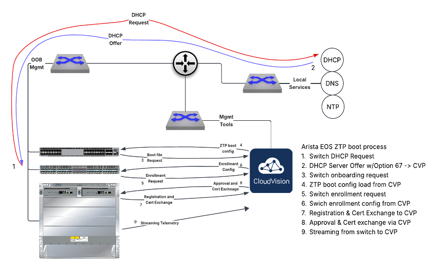
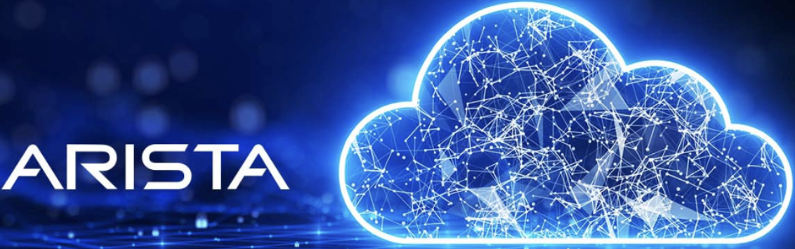

<!-- Google tag (gtag.js) -->

[![Image Placement][1]][2]
[1]: img/arista-federal-logo.png
[2]: http://www.aristafederal.com

# Welcome to the August 2026 edition of the Arista Federal Newsletter, created for our valued Federal Agency and Federal System Integrator partners.

Each month, we strive to do more than share technology updates. We highlight people, events, and moments in history that embody the qualities we value most: leadership, innovation, resilience, integrity, and the relentless pursuit of excellence. We hope these stories not only inform but also inspire, reminding us that the greatest achievements often come from individuals and organizations willing to challenge conventional thinking and rise above adversity.

This month, we pay tribute to one of America's greatest Olympians, **Jesse Owens**, whose performance at the **1936 Berlin Summer Olympics** transcended athletics and became one of the defining moments in modern history.

Competing before the world on a stage designed to showcase Nazi propaganda, Owens carried the hopes of the free world on his shoulders. Through extraordinary determination, courage, and character, he shattered racist ideology by winning **four gold medals**, setting Olympic records in each of his individual events and helping Team USA capture gold in the 4x100-meter relay. His achievements remain a powerful reminder that excellence, integrity, and perseverance will always triumph over division and intolerance.

**Jesse Owens' Four Gold Medal Performances:**
- **100-Meter Dash** – Gold Medal (August 3, 1936) -  Won his first gold medal, tying the world record with a time of **10.3 seconds**.

- **Long Jump** – Gold Medal (August 4, 1936) -  Won his second gold with an Olympic record jump of **8.06 meters (26 ft 5¼ in)**.

- **200-Meter Dash** – Gold Medal (August 5, 1936) -  Won his third gold medal while setting a new Olympic record of **20.7 seconds**.

- **4x100-Meter Relay** – Gold Medal (August 9, 1936) -  Anchored the U.S. team to victory, winning his fourth gold medal and helping set a new world record of **39.8 seconds**.  

Nearly ninety years later, Owens' legacy continues to inspire not only in sports but also in leadership, innovation, and the pursuit of excellence.

At **Arista Networks**, we share a similar philosophy: success isn't built on complexity, it's built on consistency, preparation, and execution. Just as Jesse Owens mastered the fundamentals to perform at the highest level, Arista has built its reputation on a single, consistent operating system - **EOS** - that powers everything from the campus edge to the AI data center. One operating system, one automation framework, one management platform, and one uncompromising standard of reliability.

For our federal customers, where every mission demands resilience, security, and operational simplicity, consistency is far more than a technical advantage; it is a mission advantage. Whether supporting the warfighter, enabling secure government services, or accelerating AI initiatives, Arista helps agencies achieve gold-medal performance through an architecture that is simple, scalable, secure, and built for mission success.

As you read this month's newsletter, we hope Jesse Owens' story serves as a reminder that the greatest victories are not measured solely by medals or milestones, but by the courage to lead, the discipline to prepare, and the lasting impact we leave on those who follow.

In this month’s newsletter, you’ll find:

- **The Hidden Cost of Delaying Your Network Switch Refresh**

    Arista Federal Client Director Kevin Carey explains why delaying a network refresh may save capital in the short term but often results in higher long-term costs through increased downtime, cybersecurity risk, operational complexity, and limited AI readiness. Learn why network modernization is a strategic investment and how Arista's unified platform powered by EOS, CloudVision, and AVA helps Federal agencies reduce total cost of ownership, simplify operations, strengthen security, and build resilient, AI-ready networks for the future.

- **Three-Part Technical Series: Zero Touch. Total Domination**

    In the first installment of this exciting three-part series, Arista Federal's Casey Durst (SE) and Brady Schulman (ASE) demystify Zero Touch Provisioning (ZTP) and show how Arista makes rapid, secure, and repeatable network deployments a reality. This month, they cover the fundamentals and prerequisites for ZTP. In September, they'll walk through the complete environment setup and execution process, and in October, they'll demonstrate device verification, automated configuration, and operational handoff. Whether you're just getting started or looking to simplify large-scale deployments, this is a series you won't want to miss.

We welcome your feedback, ideas, and requests for this newsletter at <fed@aristafederal.com.>

As always, thank you for your partnership and trust in Arista. We remain committed to helping our customers build secure, resilient, and modern network infrastructures that support mission success today and well into the future.

---

## **Arista Blog**

[![Image Placement][3]][4]
[3]: img/blog.png
[4]: https://blogs.arista.com/blog

---
## **Zero Touch. Total Domination.**

Casey Durst, SE and Brady Schulman, ASE, Arista Networks Federal

Some time ago, I would deploy networks in areas that were both geographically challenging and personnel constrained. The closest to ‘zero touch’ we would get was Lance Corporal Durst getting a text file with the configurations and copy / pasting into the switch and then using COA 5 (Hope) to bring the device online (IYKYK). While times have changed and technology has surpassed this copy / paste / hope method, Arista Networks focuses on support to all our customers and prospective customer base. That means, the Marine or Sailor or Soldier need not be burdened with complex configuration guides that have built-in assumptions but rather, explain in a step-by-step method how to utilize modern technologies. It is our intent to lay out the entire Zero Touch Provisioning (ZTP) process into a three-part series which can be compiled and sent to those in need for their use and, most importantly, garner their feedback to allow us to focus on what matters to them. 

Part One provides an overview of the process. Part Two will cover setting up the environment to support ZTP. Part Three will walk through the ZTP process end to end, including deploying a configuration and exiting ZTP mode.

**Part One: Overview**

Zero Touch Provisioning (ZTP) serves as Arista’s streamlined answer for automating device deployments. It enables the swift rollout of network assets without the necessity for on-site engineering presence. Engineered to harness the full potential of Arista’s Extensible Operating System (EOS), ZTP delivers a versatile, hands-off framework that accelerates installation timelines, minimizes manual mistakes, and scales across diverse operational environments while, most importantly, can be used by any network engineer skill level in your organization. 

We have heard this before, right? How many things in your life are marketed to this “it just works” methodology but are more complex than just doing what we have historically done? As with anything, setting the conditions for your deployment is key to enabling the full spectrum of ZTP- and we’re here to provide an outline of those requirements- so it does “just work.”

Let’s get the minimum version identified: ZTP requires platforms with Trusted Platform Chip (TPM) with the minimum versions for FIPS (140-3) requirements. Your Federal sales team will ensure the devices you procure meet the Government requirements: 

EOS (Extensible Operating System): &gt;4.32

CloudVision Portal: &gt;2024.1.0

**Arista is now shipping all devices with EOS newer than 4.32. Also, note that ZTP will not work over a port-channel. Just keep it simple: one cable, one port. Remember, Arista utilizes one operating system across all route / switch platforms- so you don’t have to go dig to find out what OS works on what platform. Save time and your frustration with EOS!

Now that we have those minimums, we need to verify our operational environment is staged to support ZTP. What is needed?

1. DHCP server runs locally or on another area of the network. There are numerous DHCP server types and methods that we cannot attempt to walk through here. Part Two of this series will demonstrate one typical example. Whatever your environment looks like, ensure that these DHCP options are configured to support your ZTP devices:

    a.  Subnet range that can reach your CloudVision Portal. If your CVP is remote there will be unique challenges to overcome such as whitelisting or routing to adjacent or external sites. 

    b.  Default Gateway for the switch that routes to CVP

    c.  NTP. Time synchronization is vital for registering to CVP

    d.  DNS Server & DNS Domain (optional)

    e.  Option 67: Bootfile (https://<CVPIP>/ztp/bootstrap). 

2.  A CloudVision Portal instance that is already configured and accessible. We will not address this in this article, but numerous resources exist to ensure a properly configured CVP. Configuring the Compliance Token and ZTP Permitted Devices in CVP will be covered in Part Two of this series.

3.  An Arista switch with enough space in its new environment (rack / power), a cable that connects to an upstream device, and proper communications to the DHCP server and all other requirements. Ensure accessibility and all grounding requirements are completed. 

**Figure 1: ZTP Process**

Figure 1 above provides a high-level overview of the process. ZTP is enabled by default on all switches that come from the factory. No extra step is required by the network admin! ZTP starts by trying to figure out how to communicate on the network. It looks for a DHCP server accessible via any connected network cable, management or data plane. The DHCP server provides instructions on how to reach the next required component, CloudVision Portal.

CVP provides the switch with a basic running configuration to boot and establish communications back to CVP. CVP will validate the hardware of the switch and, if allowed by policy, add the switch to the active inventory. 

One of the other considerations is whether this site will use a dedicated Out of Band Management (OOBM) network. If a dedicated OOBM will be used, simply connect the Management port to the OOBM and ensure routing. If an OOBM will not be available, any data port may be used to support the ZTP process. Configuring the switch for in-band connectivity to CVP takes a little bit more planning but is not difficult. CloudVision’s Change Control process and rollback functionality ensures you don’t lose connectivity accidentally.
 
Now you’re at your site, you have confirmed the above outline is online, and you have access to CVP for inventory management… you’re ready to go. 

This ends Part One overview of ZTP with Arista. Hopefully, you understand that the baseline requirements are significantly less challenging than previous iterations or other vendors. Come back next month as we explain Part Two: Execution. 

**Zero Touch Provisioning**

**Part Two: Execution**

Come back in September for the next iteration of the ZTP process! We will detail the environment setup, outline how ZTP processes communications from device to CloudVision, how to engage or disengage, restart, or replace a device.  We will also provide sample working configurations for the topics covered in Part One.

**Zero Touch Provisioning**

**Part Three: Verification and Device Configuration**

The final element in October will be the verification that the device is in inventory and turned over for baseline configuration for operations and security and exiting ZTP mode. 

---

## **The Hidden Cost of Delaying Your Network Switch Refresh**

By Kevin Carey – Arista Federal Client Director

Organizations often delay refreshing their network infrastructure to defer capital expenditures, but the true cost of postponing a switch upgrade is rarely reflected in the budget. As network hardware ages, organizations face rising operational expenses, increased cybersecurity risks, and reduced agility often resulting in a significantly higher total cost of ownership than a proactive, well-planned refresh.

Legacy switches eventually reach End of Support (EoS), leaving organizations without access to critical software updates, security patches, and vendor support. At the same time, aging hardware becomes more susceptible to failures, driving up maintenance costs, increasing unplanned downtime, and consuming valuable IT resources. Older platforms also struggle to support today&#39;s bandwidth-intensive applications, AI workloads, high-performance computing (HPC), next-generation Wi-Fi, and Zero Trust initiatives, creating bottlenecks that can directly impact mission-critical operations.

The rapid advancement of Artificial Intelligence (AI) makes delaying a network refresh even more costly. AI is fundamentally reshaping how Federal agencies and enterprises operate, driving unprecedented demand for higher bandwidth, ultra-low latency, real-time telemetry, and high-performance east-west traffic. Whether enabling AI-powered cybersecurity, large language models (LLMs), predictive analytics, mission planning, or autonomous systems, AI workloads place far greater demands on network infrastructure than traditional applications. Organizations that fail to develop a network modernization strategy today risk limiting their ability to adopt AI tomorrow. Even if large-scale AI deployments are still several years away, establishing a modernization roadmap now ensures the network can evolve alongside rapidly changing mission requirements without disruptive, last-minute upgrades.

Another often-overlooked cost is operational complexity. Supporting multiple generations of networking hardware, operating systems, and management platforms increases configuration inconsistencies, lengthens troubleshooting cycles, expands training requirements, and slows the deployment of new capabilities. These hidden inefficiencies quietly increase operational expenses year after year while limiting an organization&#39;s ability to innovate.

This is where Arista Networks delivers a distinct advantage. Rather than simply replacing legacy hardware, Arista provides a modern networking architecture purpose-built to simplify operations while supporting the next generation of mission requirements. Built on the industry&#39;s proven Extensible Operating System (EOS), Arista delivers a single, consistent software image across campus, data center, AI fabrics, and routing platforms. This architectural consistency dramatically reduces operational complexity, shortens learning curves, simplifies lifecycle management, and enables IT teams to automate and manage the entire network through a common operational framework.

Arista&#39;s CloudVision platform extends these capabilities by providing centralized management, streaming telemetry, compliance monitoring, automated provisioning, and comprehensive network-wide visibility. Rather than reacting to outages after they occur, organizations gain continuous insight into network health, enabling them to proactively identify issues, enforce configuration compliance, and accelerate troubleshooting before users are impacted. The result is greater operational efficiency, lower operating costs, faster service delivery, and improved mission readiness.

Arista is also leading the next evolution of network operations with Arista AVA (Autonomous Virtual Assist), an innovative Agentic AI platform designed to transform how networks are managed. Unlike traditional AI assistants that simply answer questions, AVA functions as an intelligent operations partner. It understands user intent, correlates telemetry across the network, identifies root causes, recommends remediation steps, and can automate routine operational tasks. Powered by Arista&#39;s rich telemetry, the CloudVision data lake, and decades of networking expertise, AVA enables IT teams to resolve issues faster, reduce manual effort, and improve operational resilience. As Agentic AI reshapes enterprise IT, Arista is leading the industry by embedding AI directly into network operations, helping Federal organizations transition from reactive network management to autonomous, intelligent operations.

This uniquely positions Arista to help agencies not only build networks capable of supporting AI workloads but also use AI to operate those networks more efficiently. By combining EOS, CloudVision, and AVA, Arista delivers a unified operational platform that simplifies management today while laying the foundation for the autonomous, AI-driven networks of tomorrow. For Federal agencies facing increasing mission demands, evolving cyber threats, and constrained budgets, this integrated approach represents a transformational shift in how networks are deployed, secured, automated, and optimized.

Unlike traditional networking vendors that require multiple operating systems, management platforms, feature licenses, and operational models across different product families, Arista offers a single, unified architecture that seamlessly scales from the campus edge to the data center, cloud, and AI infrastructure. This consistency not only simplifies operations but also reduces training requirements, minimizes human error, accelerates deployments, and protects long-term technology investments. As agencies modernize and prepare for AI-driven missions, Arista provides a stable, future-ready foundation that can evolve without requiring wholesale architectural changes.

Network refreshes should no longer be viewed as simply replacing aging hardware and should be recognized as a strategic investment in mission readiness, cybersecurity, operational efficiency, and AI preparedness. By proactively modernizing with Arista, Federal agencies and defense organizations can reduce total cost of ownership, strengthen their security posture, simplify network operations, and build a scalable, future-ready network

---
## __Webinars and Events__  

-   __Webinars__  

    --- 

    We make is easy for you to view products that are of interest, all virtually! Technical memebers of the team showcase outstading explanation of the products. Click below to see our list of Webinars. 

    [Arista Webinars](https://www.arista.com/en/company/news/webinars){.md-button}

-   __Events__ 

    ---
    Join us in person to get a closer look in our list of produts and solution, as well as get the chance to meet members of the team. Click below to see our list of ipcoming Events. 

    [Upcoming Events](https://www.arista.com/en/company/news/events){ .md-button }

--- 

## __*Software Updates*__

*Stay informed on the latest software updates across all Arista products and services.*

|  Software    | Version      |  Release Date |
| :-----------: | :-----------: | :-----------: |
| __EOS__           | 4.33.8M   4.22.11M   4.34.6M   4.35.4M | May 12th, 2026   May 6th, 2026   May 6th, 2026   May 23rd, 2026 |
| __CVP__           | Portal 2026.1.0   Appliance 7.1.0   Sensor 1.3.0 | March 30th, 2026   September 2nd, 2025   December 5th, 2025 |
| __DMF__           | 8.10.0 | April 22nd, 2026 |
| __CV-CUE__         | 21.0.0 | January 16th, 2026 |
| __Arista NDR__     | 5.3.5 | July 16th, 2025 |
| __TerminAttr__     | 1.42.1 | February 4th, 2026 |
| __VeloCloud SD-WAN__  Orchestrator/Gateway/Edge | 6.4.1 | December 19th, 2025 |

[View All Latest Software Updates](https://www.arista.com/en/support/software-download){: .md-button .md-button--primary target="_blank" }

---

## __* Security Advisories and Field Notices*__

*Stay informed on the latest platform security and field notice updates. For more information on Arista's statement on AI-Enhanced Security and Resilience regarding Mythos and project Glasswing, [click here.](https://www.arista.com/assets/data/pdf/glasswing/QA-Project-Mythos-Glasswing.pdf){: target="_blank" }*

### **Security Advisories**
* **Dirty Frag Vulnerability** — [Security Advisory 0138](https://www.arista.com/en/support/advisories-notices/security-advisory/24019-security-advisory-0138){: target="_blank" }   *(May 8th, 2026)*
* **Tunnel Decapsulation Configuration** — [Security Advisory 0137](https://www.arista.com/en/support/advisories-notices/security-advisory/24005-security-advisory-0137){: target="_blank" }   *(May 5th, 2026)*
* **Copy Fail Vulnerability** — [Security Advisory 0136](https://www.arista.com/en/support/advisories-notices/security-advisory/24004-security-advisory-0136){: target="_blank" }   *(May 1st, 2026)*

### **Field Notices**
* **CloudEOS Pay As You Go** — [Field Notice 0128](https://www.arista.com/en/support/advisories-notices/field-notice/24021-field-notice-0128){: target="_blank" }   *(May 11th, 2026)*
* **Default Option Change in the Access Point Upgrade Feature in CV-CUE** — [Field Notice 0127](https://www.arista.com/en/support/advisories-notices/field-notice/24016-field-notice-0127){: target="_blank" }   *(May 5th, 2026)*
* **TerminAttr** — [Field Notice 0126](https://www.arista.com/en/support/advisories-notices/field-notice/24003-field-notice-0126){: target="_blank" }   *(May 4th, 2026)*

 

[View All Latest Advisories & Notices](https://www.arista.com/en/support/advisories-notices){: .md-button .md-button--primary target="_blank" }

---

## __* Product Updates*__

*Stay up to date on all new Arista Product Releases, as well as End of Sale/End of Support Notices.*

### **New Product Releases** * **Q1 2026** — [Ask AVA - CloudVision as a Service (beta feature)](https://www.arista.io/help/articles/overview-core-tools-ask-ava){: target="_blank" }

###  **End of Sale / End of Software Support**
* **May 15th, 2026** — [VeloCloud Security VNF Services](https://www.arista.com/en/support/advisories-notices/end-of-support/24027-end-of-availability-for-velocloud-security-vnf-services){: target="_blank" } 

 

[View All Latest End of Sale & Support Notices](https://www.arista.com/en/support/advisories-notices/endofsale){: .md-button .md-button--primary target="_blank" }

---

## Did You Know? 
Arista has revamped their certifications! The new **Arista Certified Engineer (ACE)** program is now organized by specific tracks like Cloud Data Center, Campus, and Automation to better align with your job role.

[Start your ACE journey now](https://www.training.arista.com/){ .md-button .md-button--primary target="_blank" }

---
# *Feel Free to Reach Out To Us For Your Network Needs* 
<figure markdown>
{: style="height:300px;width:800px"}  
    <figcaption></figcaption>
</figure>
We thank you for taking the time to read out newsletter today. Feel free to reach out to your SE or ASE for more information or questions regardsing your network operations. Until next month, have a good one! 