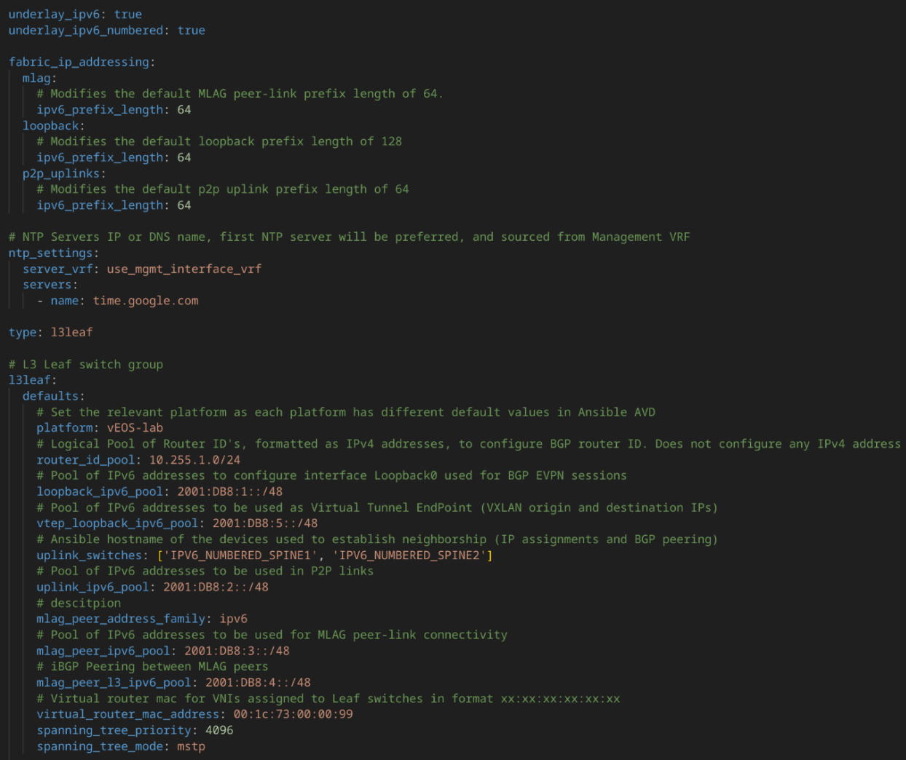
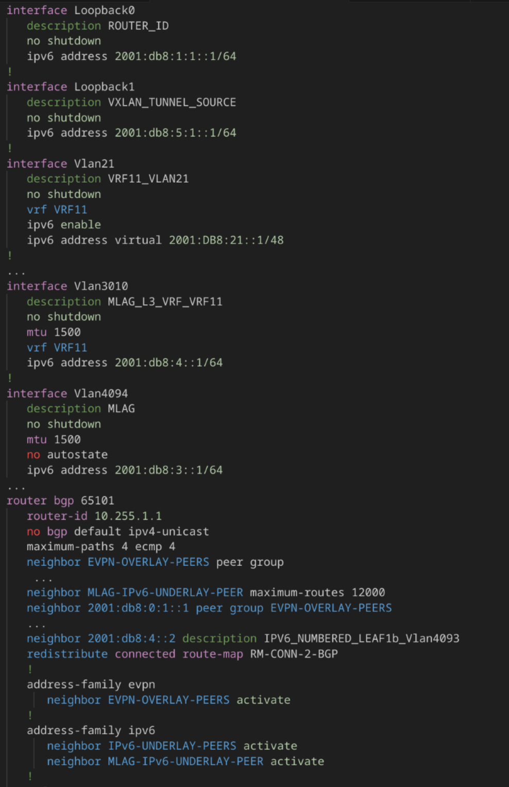
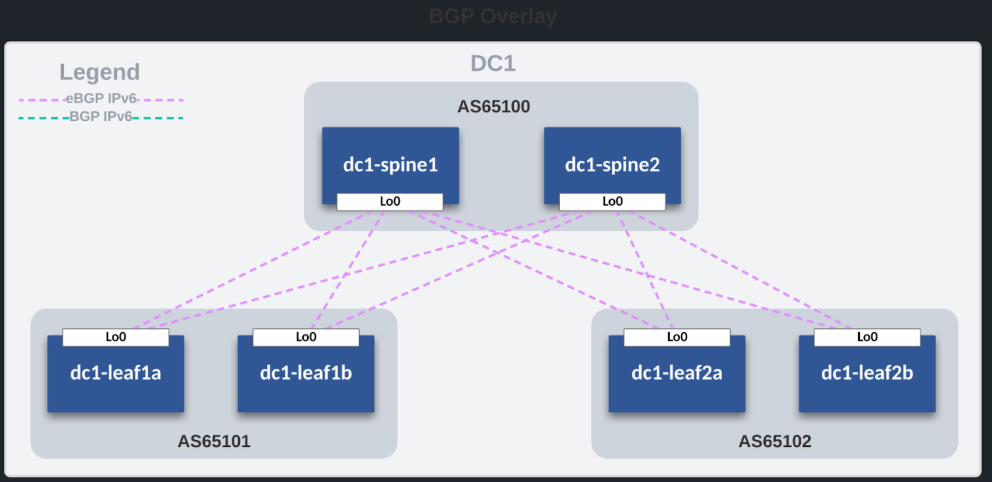

<!-- Google tag (gtag.js) -->
<script async src="https://www.googletagmanager.com/gtag/js?id=G-74HMNYLH82"></script>
<script>
  window.dataLayer = window.dataLayer || [];
  function gtag(){dataLayer.push(arguments);}
  gtag('js', new Date());
  gtag('config', 'G-74HMNYLH82');

</script>

<a href="http://www.aristafederal.com" target="_blank">
  
</a>

# Welcome to the September 2025 Edition of the Arista Federal Newsletter!

What a great time of year,  fall is starting to emerge, the MLB playoffs are around the corner, and the NFL and College Football seasons are in full swing. We hope you're enjoying the season and cheering on your favorite teams!

In this edition, we celebrate the __10th anniversary of Arista CloudVision®__, our flagship network-wide management and automation platform.  

We're also excited to share two timely articles:

* __Why Do All Your OSPF Costs Show 10 in EOS?__ -- Arista Federal SE Cass Bell explains why it happens, why it’s not “broken,” and the 60-second fix to align your OSPF metrics with real-world paths.

* __The Clock Is Ticking on the OMB IPv6 Mandate!__ -- Arista Federal ASE Dustin Lee outlines why IPv6 is critical for federal networks — scalability, security, modernization — and how Arista is building the IPv6 capabilities customers need in AVD (Architect, Validate, Deploy) to stay future-ready.

As we move into fall, we look forward to bringing you more updates, insights, and opportunities to help advance your mission. This newsletter is for you and we welcome your feedback, ideas, and requests at fed@aristafederal.com.

Thank you for reading the Arista Federal Newsletter — your go-to source for the latest innovations, industry insights, and mission-focused networking solutions for Federal Agencies and System Integrators.

---

## **Arista Blog**

This year marks the 10th anniversary of Arista CloudVision®, our flagship network-wide management and automation platform. Since its launch, CloudVision has transformed how organizations design, operate, and secure their networks delivering simplicity, agility, and real-time visibility at scale. Over the past decade, it has become a cornerstone for our customers, helping federal agencies and enterprises alike modernize operations, reduce complexity, and accelerate mission outcomes. As we celebrate this milestone, we remain committed to driving innovation and delivering even greater value in the years ahead.

<a href="https://blogs.arista.com/blog/cloudvision-the-first-decade-2025">
https://blogs.arista.com/blog/cloudvision-the-first-decade-2025
</a>

<a href="https://blogs.arista.com/blog" target="_blank">
  
</a>

---

## **​The Office of Management and Budget mandates the transition to IPv6**
By: Dustin Lee, Advanced Services Engineer, US Federal

The Office of Management and Budget (OMB) mandated the transition to IPv6 because the
U.S. federal government needs to ensure long-term scalability, security, and innovation across
its IT infrastructure. Here are the key reasons behind the mandate:

**1. IPv4 Address Exhaustion**

* IPv4 has only about 4.3 billion unique addresses, most of which have already been
allocated.
* Federal agencies need the ability to support growing numbers of users, devices, and
services — something IPv4 alone cannot accommodate.
* IPv6 provides an almost limitless pool of addresses (340 undecillion), ensuring future
growth.

**2. Modernization and Innovation**

* IPv6 is designed for today’s internet scale, supporting cloud services, mobile devices,
and IoT (Internet of Things).
* It simplifies network operations by removing the need for workarounds like Network
Address Translation (NAT).
* OMB sees IPv6 as critical to modernizing federal networks and enabling digital
transformation initiatives.

**3. Security and Efficiency**

* IPv6 has built-in features that improve security and efficiency, including mandatory
support for IPsec.
* It enables end-to-end encryption and better traffic routing.
* These features align with federal cybersecurity modernization priorities.

**4. Policy and Global Alignment**

* Many parts of the world (e.g., APAC, Europe) have already widely adopted IPv6.
* The U.S. government wants to ensure interoperability with international partners and
avoid falling behind.
* OMB’s 2020 Memorandum (M-21-07) requires agencies to transition at least 80% of IP-
enabled assets to IPv6-only by 2025.

​**​Bottom-Line**

OMB has mandated IPv6 because IPv4 is running out of space, IPv6 supports modernization
and cybersecurity, and the U.S. government must align with global internet standards to stay
future-ready.

With a Federal mandate dictating not only the adoption of IPv6 but a complete transition, full
integration of IPv6 into core services is more important than ever. With this goal in mind the
​Arista Federal ASE ​Team​, in close collaboration with the core AVD developers, have added
critical IPv6 capabilities into AVD to address the needs of our customers.

**AVD IPv6 capabilities <= AVD 5.4**

* IPv6 overlay
* RFC 5549 (Unnumbered) underlay
* IPv4 still required for full functionality
* Best Effort support

**AVD IPv6 capabilities >= AVD 5.5**

* Previous Capabilities +
* Full IPv6 numbered underlay support
* Dual Stack not required
* IPv6 testing added to network services
* IPv6 support added to ANTA (Arista Network Test Automation)

**Usage**

A full reference example has been provided and is accessible at: 

<a href="https://avd.arista.com/5.5/ansible_collections/arista/avd/examples/single-dc-l3ls-ipv6/index.html">
https://avd.arista.com/5.5/ansible_collections/arista/avd/examples/single-dc-l3ls-ipv6/index.html
</a>

The highlights of turning on Ipv6 AVD:

* underlay_ipv6: true
* underlay_ipv6_numbered: true

Adding these two knobs enables configuration of a Full IPv6 overlay and underlay for an EVPN/VxLAN fabric 

<figure markdown>

    <figcaption></figcaption>
</figure>

**Output**

The following example highlights AVD’s IPv6 capabilities in action.
<figure markdown>

    <figcaption></figcaption>
</figure>

**Results**
<figure markdown>

    <figcaption></figcaption>
</figure>

With the release of AVD 5.5, federal agencies now have a clear and supported path to meeting the OMB mandate for IPv6 adoption. By enabling full IPv6 numbered underlay support and removing the dependency on dual stack, agencies can confidently automate modern EVPN/VxLAN fabrics using IPv6 as the foundation.

These enhancements, validated through integrated testing with ANTA, provide federal customers with the assurance that IPv6 integration into AVD is not only achievable but operationally sustainable. 

Arista is committed to ensuring compliance with federal directives while advancing towards a future-ready network architecture.

---
## **Why Your Arista OSPF Costs All Say 10 (and the 60-second fix)**
By: Cass Bell, Systems Engineer, US Federal

OSPF (Open Shortest Path First) is a standard link-state interior gateway protocol (IGP) used in large enterprise networks to dynamically determine the most efficient routes within an autonomous system (AS) using the Dijkstra Shortest Path First (SPF) algorithm. It achieves fast convergence by building a complete network topology map from link-state advertisements (LSAs) and offers scalability and efficiency for complex networks, although it requires more router CPU and memory resources.

**The surprise**

On Arista EOS, OSPF interface costs often appear as 10 across many links rather than reflecting link speed. If you’re looking for the classic OSPF formula (cost = reference_bandwidth / interface_bandwidth), EOS doesn’t apply it by default and interfaces typically show a cost of 10 until you set a modern reference bandwidth or explicit per-interface costs.

**Why it happens**

* Classic OSPF uses a reference bandwidth (historically 100 Mbps). Anything ≥1 Gbps computes to ≤1, which gets floored to 1, not very helpful in modern fabrics.

* On EOS, if you don’t deliberately set a modern reference or explicit costs, interfaces may appear with a fixed cost (10), masking real differences between 1/10/25/40/100/400G paths.

**The 60-second fix**

Pick a modern reference bandwidth and set it under OSPF on every router in the domain.

```
router ospf <PROCESS-ID>
   auto-cost reference-bandwidth 100000   ! 100G in Mbps
```

**Guidance**

Choose a value ≥ your fastest link (e.g., 100000 for 100 G, 1000000 for 1 T).

Use the same value everywhere to avoid asymmetric path costs.

**Quick presets you can copy**

Datacenter cores/fabrics (10/25/40/100G+)

```
router ospf 100
  auto-cost reference-bandwidth 100000
```

**Campus cores (1/10/40G)**

```
router ospf 10
   auto-cost reference-bandwidth 10000
```


**Verify in the field**

```
show ip ospf interface brief

show ip ospf interface <INTF>

show running-config section ospf
```

**Rollout playbook (safe and fast)**

* Survey current costs: show ip ospf interface brief.

* Pick a reference ≥ your fastest link.

* Standardize: set auto-cost reference-bandwidth on all OSPF routers.

* Validate with show ip ospf interface and a quick traceroute/ECMP check.

**Gotchas to avoid**

* Inconsistent reference across neighbors → asymmetric path selection.

* Don’t assume EOS auto-adjusts OSPF costs. It won’t unless you configure it with auto-cost reference-bandwidth.

**Bottom line**

Seeing cost 10 everywhere isn’t “broken,” but it hides real topology differences. Standardize on a modern auto-cost reference-bandwidth and tidy up outliers. Your LSAs (and your traffic) will thank you.  

---

## __*Upcoming Events*__  
Arista hosts various events throughout the year for you! Members of our team organize these informative events to showcase Arista's ability to not only help improve your network, but to also assist by providing a set of tools to improve your operations! Click on the boxes below to be directed to Arista's website for lists of Webinars and Events.

<div class="grid cards" markdown>

-   __Arista Network Webinars Series with Carahsoft__

    <a href="https://carahevents.carahsoft.com/Event/Details/618442-arista-networks" target="_blank">
      
    </a>

    |  Date | Name| Description | 
    | :-----------: | :-----------: | :-----------: |
    | __October 14__ | vSphere Integration | Join Paul Mancuso, Systems Engineer at Arista Networks, for an in-depth look at how Arista's CloudVision and EOS streamline integration with VMware vSphere.. This session will explore how Arista's solutions enhance automation, visibility, and operational efficiency across virtualized federal data centers. Learn how to simplify network operations and accelerate mission outcomes through seamless vSphere integration. |
    | __November 18__ | Arista Campus Solutions | Discover how Arista is extending its reliable, scalable, and secure networking capabilities to campus environments that are perfect for federal agencies with distributed locations. |

    [Register Here](https://carahevents.carahsoft.com/Event/Details/618442-arista-networks){.md-button}

</div>


<div class="grid cards" markdown>

-   __Webinars__  

    --- 

    We make is easy for you to view products that are of interest, all virtually! Technical memebers of the team showcase outstading explanation of the products. Click below to see our list of Webinars. 

    [Arista Webinars](https://www.arista.com/en/company/news/webinars){.md-button}

-   __Events__ 

    ---
    Join us in person to get a closer look in our list of produts and solution, as well as get the chance to meet members of the team. Click below to see our list of ipcoming Events. 

    [Upcoming Events](https://www.arista.com/en/company/news/events){ .md-button }


</div>

--- 

## __*Software Updates*__
<figure markdown>
{: style="height:200px;width:300px"}    
    <figcaption></figcaption>
</figure>
For new code releases, click [here](https://www.arista.com/en/support/software-download) 


   |  Softwares    | Versions      |  Release Date |
   | :-----------: | :-----------: | :-----------:
   | __EOS__           | 4.32.6.1M <br> 4.33.4M <br> 4.32.6M <br> 4.34.1F <br>  | July 2nd, 2025 <br> June 23rd, 2025 <br> June 20th, 2025 <br> June 16th, 2025 <br> 
   | __CVP__           | Portal 2025.2.0 <br> Appliance 7.0.1 <br> Sensor 1.1.0 <br>    | July 4th, 2025 <br> January 28th, 2025<br> March 24th, 2025 <br>
   | __DMF__           | 8.6.2 <br >| June 23rd, 2025 <br> 
   | __WLAN__ <br>CV-CUE<br>Wireless Manager<br> | <br> 19.0.0 <br>19.0.0<br>       | <br> July 25th, 2025<br>June 12th, 2025<br>
   | __Arista NDR__         | 5.3.5         | July 16th, 2025
   | __TerminAttr__    | 1.37.2 <br>       | April 9th, 2025 <br> 


---
## __*Software Advisories*__
Below is a list of advisories that are announced by Arista. To view more details on the specific advisories, please click the links in the middle row.

| Name          | Advisory Link           | Date of Advisory Notice  |
| :-----------: |:-------------:| :-----:|
|  __Global Common Encryption Key__   | [Security Advisory 0122](https://www.arista.com/en/support/advisories-notices/security-advisory/22022-security-advisory-0122)  | July 22nd, 2025   |  
|  __UDP Source Port 3503 Packets__   | [Security Advisory 0121](https://www.arista.com/en/support/advisories-notices/security-advisory/22021-security-advisory-0121)  | July 22nd, 2025   |  
|  __CVP Reverse Proxy__   | [Field Notice 0111](https://www.arista.com/en/support/advisories-notices/field-notice/22238-field-notice-0111)  | September 3rd, 2025   |  
|  __CVP Disc Usage__   | [Field Notice 0110](https://www.arista.com/en/support/advisories-notices/field-notice/22237-field-notice-0110)  | September 3rd, 2025   | 
|  __Last Support Release WiFi 6 Platforms__   | [Field Notice 0109](https://www.arista.com/en/support/advisories-notices/field-notice/22049-field-notice-0109)  | August 13th, 2025   |   
|  __Guest Manager Analytics- Data Opt Out__   | [Field Notice 0108](https://www.arista.com/en/support/advisories-notices/field-notice/22034-field-notice-0108)  | August 1st, 2025   |  


For a list of the most current advisories and notices, click [Here](https://www.arista.com/en/support/advisories-notices)

---

## __*Product Updates*__
<figure markdown>
{: style="height:200px;width:400px"}   
    <figcaption></figcaption>
</figure>
**End of Sale** notices are listed below.

| Device        | Name           | End Of Sale Date  |
| :-----------: |:-------------: |     :----:        |
| Software      | [End of Software for CloudVision Portal 2023.2](https://www.arista.com/en/support/advisories-notices/end-of-support/21412-end-of-software-support-for-cloudvision-portal-2023-2-release-train)<br>[End of Software Support for EOS 4.28](https://www.arista.com/en/support/advisories-notices/end-of-support/21275-end-of-software-support-for-eos-4-28)<br>[DMF and CCF Deployments on Accton/ Edgecore Switches](https://www.arista.com/en/support/advisories-notices/end-of-support/21094-end-of-support-for-dmf-and-ccf-deployments-on-accton-edgecore-switches)<br>[EOS-4.34 and later no longer supported on select switches](https://www.arista.com/en/support/advisories-notices/end-of-support/21089-end-of-software-support-for-7280r-r2-7500r-r2-and-7020r-series)<br> | May 27th. 2025 <br> March 14, 2025 <br>January 31st, 2025 <br>January 15th, 2025 <br> |
| CVP           | [CVP IPAM Application](https://www.arista.com/en/support/advisories-notices/endofsupport) <br> [CVP 2023.3](https://www.arista.com/en/support/advisories-notices/end-of-support/21627-end-of-software-support-for-cloudvision-portal-2023-3-release-train)          |  July 14th, 2025 <br> June 17th, 2025   |
| DMF           | [DMF 8.3](https://www.arista.com/en/support/advisories-notices/end-of-support/21417-end-of-software-support-for-dmf-8-3)          |  June 3rd, 2025           |
| Switches      | [DCS-7020R Series](https://www.arista.com/en/support/advisories-notices/end-of-sale/21052-end-of-sale-of-the-arista-dcs-7020r-series)<br> |  December 20th, 2024  |
| VeloCloud      | [SASE Secured by Symantec](https://www.arista.com/en/support/advisories-notices/end-of-sale/22072-end-of-sale-life-velocloud-sase-secured-symantec)<br> [Software Defined (SD) Access](https://www.arista.com/en/support/advisories-notices/end-of-sale/21653-end-of-sale-end-of-life-for-velocloud-software-defined-sd-access) <br> |  August 20th, 2024 <br> July 1st, 2025 | 


**New Releases** of Arista's device are listed below 

|  Device       | More Information |  Release Date 
    | :-----------: | :-----------:    | :-----------:
    | Arista VeloCloud | [VeloCloud Acquisition](https://www.arista.com/en/company/news/press-release/21646-pr-07012025) | Q3 2025
    |  Arista SWAG    |   [Modern Stacking for Campus](https://www.arista.com/en/company/news/press-release/20693-pr-12032024)                | Q1 2025 
    | Arista Multi-Domain Segmentaton Service  | [Arista MSS](https://www.arista.com/en/company/news/press-release/19297-pr-20240430)         | Q3 2024
    | Arista CV UNO  | [CloudVision Universal Network Observability](https://www.arista.com/en/company/news/press-release/19195-pr-20240305)  | Q1 2024


---
# *Feel Free to Reach Out To Us For Your Network Needs* 
<figure markdown>
{: style="height:300px;width:800px"}  
    <figcaption></figcaption>
</figure>
We thank you for taking the time to read out newsletter today. Feel free to reach out to your SE or ASE for more information or questions regardsing your network operations. Until next month, have a good one! 