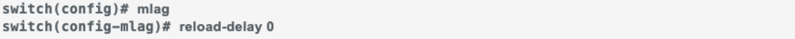
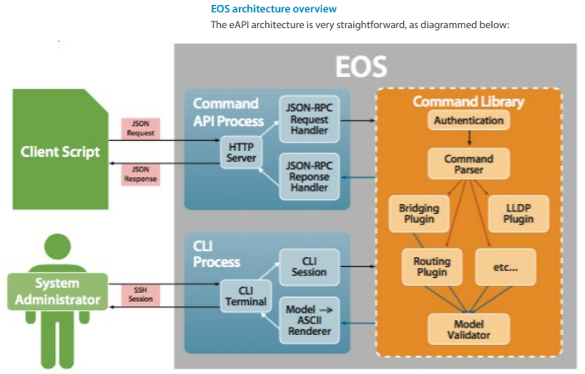

<!-- Google tag (gtag.js) -->

[![Image Placement][1]][2]

[1]: img/arista-federal-logo.png
[2]: http://www.aristafederal.com

# Welcome to the November 2025 Edition of the Arista Federal Newsletter!

As we head into the Thanksgiving season, we want to take a moment to say thank you to our incredible Federal Agencies, System Integrators, and Arista Federal Partners who continue to drive innovation, collaboration, and success across the Federal landscape.

This time of year is all about gratitude and connection, and we’re truly thankful for the trust and partnership you place in Arista.

Together, we’re helping agencies modernize their networks, simplify operations, and build the secure, cloud-first infrastructures that our nation depends on every day.

From all of us at Arista Federal, we wish you and your families a safe, joyful, and connected Thanksgiving!

In this month’s newsletter, you’ll find:

* __Arista and Palo Alto Networks Strengthen Partnership in the New Age of AI Security__

    Arista & Palo Alto announced a deepened Arista-Palo Alto partnership to deliver a modern Enterprise security architecture based on Arista MSS with "smart hooks" into an EOS EVPN fabric, and integrated with the Palo Alto NGFW management suite. The solution delivers holistic zero-trust security for both east-west and north-south traffic with optimized Firewall performance, improved resilience, and a much simplified network design to enable granular control of the traffic redirected to Firewalls in distributed Enterprise Data Centers.

      [ON-Demand Webinar - “Comprehensive Data Center Security for the Age of AI"](https://www.brighttalk.com/webcast/10903/657035?utm_source=Arista&utm_medium=brighttalk&utm_campaign=657035)

      [Arista Blog](https://blogs.arista.com/blog/arista-and-palo-alto-networks-strengthen-partnership-in-the-new-age-of-ai-security)

      [Palo Alto Blog](https://www.paloaltonetworks.com/blog/network-security/palo-alto-networks-arista-networks-partnership/)

* __Arista’s Smart System Upgrade (SSU)__

    Arista Federal SE Casey Durst explores the benefits of Smart System Upgrade (SSU) — a capability that brings new levels of network agility and uptime. With SSU, you can perform software upgrades on Arista switches while keeping traffic flowing — no lengthy downtime, no complex manual work, and no juggling dashboards. It’s a smarter, more efficient way to maintain and evolve your network without disruption.

* __Unlock the Power of Programmatic Networking with Arista EOS API (eAPI)__

    Arista Federal SE Mike Reyes breaks down how Arista’s Extensible Operating System (EOS®) API — eAPI — is transforming network automation.

This newsletter is for you and we welcome your feedback, ideas, and requests at fed@aristafederal.com.

Thank you for reading the Arista Federal Newsletter — your go-to source for the latest innovations, industry insights, and mission-focused networking solutions for Federal Agencies and System Integrators.

---

## **Arista Blog**

[![Image Placement][3]][4]

[3]: img/blog.png
[4]: https://blogs.arista.com/blog

---
## **SMART… System Upgrade**
Casey Durst, Systems Engineer, Arista Networks Federal                    
            
Some time ago while supporting ongoing kinetic military operations it was the time for the daunting required reboot of network devices for Unclassified and several Classified networks. The careful orchestration of the upgrade timelines ensuring the authorized service interruption window would not impact military operations was complete. We were given a short time to execute a zone-based reboot across the Base Area Network and Data Centers. At first, all was well but during the window we were instructed that the devices need to be back in operation and the maintenance window was canceled. The nine minute reboot could not be expedited and another device came back with the frustrating error outlining corrupted or loss of flash staring at me… tick tok. 

While the pressure for your restarts and reboots may not be at the same level or may very well exceed it, Arista Networks provides Smart System Upgrades (SSU) or ‘Hitless’ upgrades across DataCenter and Campus switching variants which may be one of the most underrated and undervalued capabilities in the Arista arsenal. 

**What is SSU?**

SSU is a solution suite designed to address some of the most complex and challenging tasks facing network administrators - network appliance maintenance. Changes to the underlying network infrastructure can affect large numbers of devices and cause significant outages. Using the flexibility of Arista design to your advantage, there are multiple variations of SSU at your disposal: 
Leaf SSU enables hitless software upgrade that allows a network operator to upgrade the software while keeping the switch data plane operational during the upgrade. Hitless upgrade is completely seamless to connected hosts ensuring uptime to services and applications to singly attached hosts during a software upgrade. 
Spine SSU introduces maintenance mode to intelligently insert and remove a spine device from the network by combining protocol based graceful shutdown and traffic redirection hence minimizing loss to application traffic. Maintenance mode enables network operation teams to stay on top of software upgrades, hardware replacements or isolated troubleshooting without taking downtime for applications.
Regardless of the network model you are operating, be it a spine-leaf topology, MLAG or other, SSU utilizes Arista’s Extensible Operating System’s (EOS) modular architecture to ensure hitless upgrades (when traffic forwarding continues uninterrupted) is available to you. For details on the EOS construct, design, and history please see the October Federal Newsletter as understanding the distributed state database is paramount to understanding how SSU functions. 

SSU orchestrates upgrades using a multi-stage process working carefully with SysDB while ‘siloing’ agents. While silo’ing may have a negative connotation in our lives, in this instance these agents acting independent of one another is used to our advantage because each does not directly impact the other; rather each informs the central SysDB of state changes.

Preparation Phase: Validate and confirm the EOS future image and ensure up to date running configurations are saved. 
Shutdown: Topology dependent but effectively the re-direction of traffic to MLAG Peers device or maintenance mode for Core spine devices. This traffic re-direction, as applicable, allows for L2 or L3 tables to populate and accept traffic during the upgrade of the primary device. 
Accelerated boot: Fast boot technology will skip unnecessary hardware initialization and load the required modules, again, based on type of device, topology, and configuration. 
Reconciliation: A graceful restart of configured protocols (OSPF, BGP, etc) allowing for traffic convergence and updates once- not progressive or consecutive state-based update(s). 

**WIFM: What’s in it for me? (you)**

We have all experienced device reloads with outages and accept it as just a part of doing business. This capability, with the flexibility built-in based on Arista’s EOS and platforms, brings renewed fervor to the planned outage frustration: 

1. Faster reload times: gaining approximately 80% of your time back
2. Hitless upgrades: upgrade during any point of the business day without impacting users
3. Traffic Redirection: Maintenance mode or traffic re-direction minimizes disruptions in multi-device architectures
4. Automation Integration: Use Ansible, Puppet, and Arista’s eAPI
6. Fault Tolerance: If a fault occurs, only that process restarts and only receives the most recent state changes. We leave the rest of the device and its capability alone. 
6. Scalable: From a few access devices or massive data center architectures managed via CloudVision, SSU is orchestrated as required by the site admins on their schedule and their capabilities. 
7. Uninterrupted connections: By sending LACP link-state information, the network connections remain active which allows traffic to continue to traverse the device
8. Intelligent insertion and removal of network elements, customized to the Spine or the Leaf layer
9. Programmatic interface to tailor upgrades to operating environment

The steps and commands utilized are outlined here, generically. You can also (and we would recommend) using CloudVision to execute SSU to ensure success of each device as it completes the upgrade and reboot process. Arista prides itself in quality and simplicity. 

1. Save the current configuration:
    <figure markdown="span">
      
      <figcaption></figcaption>
    </figure>
2. Ensure space is available for new EOS + logs
    <figure markdown="span">
      
      <figcaption></figcaption>
    </figure>
3. Verify connectivity for management
    <figure markdown="span">
      
      <figcaption></figcaption>
    </figure>
4. Verify configuration supports SSU. Fix errors presented, as required. 
    <figure markdown="span">
      
      <figcaption></figcaption>
    </figure>
5. For BGP / MP-BGP **Ensure all BGP sessions are stable; for BGP within a specific VRF, use ‘graceful-restart’ within the respective VRF
    <figure markdown="span">
      
      <figcaption></figcaption>
    </figure>
6. For switches using MLAG: 
    <figure markdown="span">
      
      <figcaption></figcaption>
    </figure>
    __Transfer new EOS image onto device via USB, FTP, SCP, HTTP__
7. Prep device to boot from new image **EOS would be the version you are upgrading to** and wr mem
    <figure markdown="span">
      
      <figcaption></figcaption>
    </figure>
8. Reboot the device
    <figure markdown="span">
      
      <figcaption></figcaption>
    </figure>
9. Verify new EOS version is utilized
    <figure markdown="span">
      
      <figcaption></figcaption>
    </figure>

The dual supervisor version is utilized in nearly the same method; however, there are some nuances with the process of rebooting to be aware of. Namely, that the secondary supervisor receives the image from the primary and both are restarted together. 

**Conclusion**

There is no doubt that the opening scenario will bring back memories for many on the Arista Federal team and our customers as each of us has our own scenario that may mimic it. Only you know the risk level of your environment but with Arista Networks, the frustrating era of 0200 maintenance windows to limit network downtime has now paved the way for day-time reboots with little risk to customers, end-users, and in our world, military operations.

---

## **Unlock the Power of Programmatic Networking with Arista EOS API (eAPI)**
Mike Reyes, Systems Engineers, Arista Networks Federal 

In today’s fast-paced data centers, manual configuration via SSH is no longer enough. Network operators need speed, reliability, and seamless integration with modern automation tools. That’s where Arista’s Extensible Operating System (EOS®) API – better known as eAPI – shines as a game-changer for network automation.

**What Makes eAPI Stand Out?**

Arista EOS offers multiple programmable interfaces for applications. The applications running on the switch or external EOS applications can leverage these interfaces. For example, Arista’s EOS API (eAPI) interface allows applications and scripts complete programmatic control over EOS with a stable and easy-to-use syntax. Once the API is enabled, the switch accepts commands using Arista’s command line interface (CLI) syntax, and responds with machine-readable output and errors serialized in JSON, served over HTTPS.

Here are the three pillars that have made eAPI a favorite among network engineers and DevOps teams worldwide:

1. Comprehensiveness
    With Arista’s eAPI, customers can access any state and configure any properties on the switch that they could otherwise do over the CLI.
    Every command available in the CLI is accessible via eAPI. From `show interfaces` to full configuration sessions (`configure terminal` → multiple commands → `end`), you get 100% parity with interactive sessions.
2. Ease of Use & Flexibility
    The simplicity of this protocol and the availability of third-party JSON clients means that eAPI is language agnostic and can integrate into any existing infrastructure and workflow. Additionally, on-box, interactive documentation for the API and return values make writing new programs simple.
    * Language-agnostic: Works with Python, Go, Ruby, PowerShell – any language with an HTTPS client.  
    * Built-in interactive documentation: Just point your browser to `https://<switch-ip>/eapi` after enabling the service.  
    * On-box API explorer at `https://<switch-ip>/eapi/spec` lets you test commands live
3. Rock-Solid Stability
    Arista ensures that a command’s structured output will remain compatible with multiple future versions of EOS. The compatibility allows end users to confidently develop critical applications without compromising their ability to upgrade to newer EOS releases and gain additional features. Furthermore, this enables scripts to operate cleanly in data centers running multiple versions of EOS without compromising eAPI’s simplicity.

Arista guarantees backward compatibility of structured output across multiple EOS releases. Upgrade your switches without breaking your automation scripts – a promise that removes the biggest barrier to adopting new features.

<figure markdown="span">
  
  <figcaption>EOS Architecture Overview</figcaption>
</figure>

* Clients send an HTTP POST request to the server using the lightweight JSON-RPC 2.0 protocol. Requests specify » The “method” to use (at this time, always “runCmds”). » A list of commands to run, for example [‘show interfaces’], or [‘configure’, ‘interface Ethernet 1’, ‘shutdown’] » A “version” number specifying which revision of the model output your script expects (at this time, always “1”).

* The server processes the request and collects a structured data model for each command, which will then be converted into JSON. The JSON-RPC 2.0 ‘error’ field is set if a command returns an error. Otherwise, the response is in the ‘result’ field. You can view further documentation on response formats at https:///eapi/spec and overview documentation at https:///eapi/overview. EOS Command Validation over eAPI and embedded EOS Sanity Checks Command and control over eAPI (configuration change or command execution) can optionally be sent with a validation flag, meaning the CLI command will not be executed on the switch but will be parsed by EOS. This function is leveraged by  Arista's AVD  (Architect, Validate, Deploy  ) and  Arista's CloudVision to ensure a CLI command or configuration change is syntactically correct and supported by the target device the platform it is executed against.

Arista AVD -- [Architect, Validate, Deploy](https://avd.arista.com/5.7/index.html)

Sanity Check functions embedded in EOS can also be programmatically called to validate a syntactically correct config change is also functionally correct. One example is the MLAG Sanity Check - a CLI command call that triggers EOS to query its neighboring MLAG switch to ensure a proposed config change will not disrupt MLAG functionality.

**Real-World Applications**

Imagine replacing an entire running configuration on hundreds of leaf and spine switches in seconds instead of hours or feeding live interface counters directly into your monitoring stack without custom parsers. Customers are already doing this:

* Zero-touch provisioning: Push complete configurations in a single API call.  
* Integration with Ansible, AVD, and Terraform: Official modules and the Arista Validated Designs (AVD) framework make eAPI the backbone of modern data-center-as-code.  
* Advanced telemetry: Pull structured `show` command output into Splunk, Elasticsearch, or Grafana with zero transformation effort.

eAPI’s completeness, stability, and ease of use make it well-suited for various customer applications. 

For example, traditional network configuration workflows involve connecting to nodes over SSH and setting the configuration command by command. eAPI makes this trivial and allows network operators to replace the entire running configuration for a device in one sequence. eAPI reduces the time to deploy a change and gives the operator a quick feedback loop. eAPI excels at integrating with third-party software. 

For example, retrieving structured JSON data from Arista nodes allows developers and operators to easily incorporate EOS nodes into network automation workflows, monitoring, and data center infrastructure management tools. In addition, another use case is for network administrators who wish to configure many nodes programmatically. The robust ecosystem around eAPI has led to integrations with popular open-source toolings such as Arista’s own Arista Validated Designs (AVD) framework and Red Hat’s Ansible Automation Platform.

**The Future Is Programmable**

As networks evolve into software-defined infrastructure, tools like eAPI are no longer nice-to-have – they are the way forward. With guaranteed stability, universal language support, and complete CLI coverage, Arista eAPI empowers you to automate everything from day-to-day operations to massive greenfield deployments.

Ready to leave SSH scripts behind?
Dive into the full technical details in the official [whitepaper](https://www.arista.com/assets/data/pdf/Whitepapers/Arista_eAPI_FINAL.pdf)

---

## __*Upcoming Events*__  
Arista hosts various events throughout the year for you! Members of our team organize these informative events to showcase Arista's ability to not only help improve your network, but to also assist by providing a set of tools to improve your operations! Click on the boxes below to be directed to Arista's website for lists of Webinars and Events.

-   __Arista Network Webinars Series with Carahsoft__

    __For Channel Partners Only__

    [![Image Placement][5]][6]
    [5]: img/arista-carasoft-v2.png
    [6]: https://carahevents.carahsoft.com/Event/Details/618442-arista-networks

    |  Date | Name| Description | 
    | :-----------: | :-----------: | :-----------: |
    | __November 18__ | Arista Campus Solutions | Discover how Arista is extending its reliable, scalable, and secure networking capabilities to campus environments that are perfect for federal agencies with distributed locations. For channel partners only. |

    [Register Here](https://carahevents.carahsoft.com/Event/Details/618442-arista-networks){.md-button}

-   __Webinars__  

    --- 

    We make is easy for you to view products that are of interest, all virtually! Technical memebers of the team showcase outstading explanation of the products. Click below to see our list of Webinars. 

    [Arista Webinars](https://www.arista.com/en/company/news/webinars){.md-button}

-   __Events__ 

    ---
    Join us in person to get a closer look in our list of produts and solution, as well as get the chance to meet members of the team. Click below to see our list of ipcoming Events. 

    [Upcoming Events](https://www.arista.com/en/company/news/events){ .md-button }

--- 

## __*Software Updates*__
<figure markdown>
{: style="height:200px;width:300px"}    
    <figcaption></figcaption>
</figure>
For new code releases, click [here](https://www.arista.com/en/support/software-download) 

   |  Softwares    | Versions      |  Release Date |
   | :-----------: | :-----------: | :-----------:
   | __EOS__           | 4.34.3.1M  4.32.8M   4.34.3M   4.35.0F    | November 4th, 2025  October 27th, 2025   October 6th, 2025   October 6th, 2025   
   | __CVP__           | Portal 2025.2.1   Appliance 7.0.1   Sensor 1.2.0      | August 21st, 2025   January 28th, 2025  September 8th, 2025  
   | __DMF__           | 8.8.0  | August 15th, 2025   
   | __WLAN__  CV-CUE  |   19.0.0        |   July 25th, 2025   
   | __Arista NDR__         | 5.3.5         | July 16th, 2025
   | __TerminAttr__    | 1.39.1         | July 18th, 2025    
   | __VeloCloud SD-WAN__   Orchestrator/ Gateway / Edge   |  6.4.0         |   May 2nd, 2025   

---

## __*Software Advisories*__
Below is a list of advisories that are announced by Arista. To view more details on the specific advisories, please click the links in the middle row.

| Name          | Advisory Link           | Date of Advisory Notice  |
| :-----------: |:-------------:| :-----:|
|  __Arista DANZ Monitoring Fabric__   | [Security Advisory 0124](https://www.arista.com/en/support/advisories-notices/security-advisory/22538-security-advisory-0124)  | October 22nd, 2025   |  
|  __Arista Edge Threat Management NGFW__   | [Security Advisory 0123](https://www.arista.com/en/support/advisories-notices/security-advisory/22535-security-advisory-0123)  | October 21st, 2025   |  
|  __WiFi 7 Access Points Firmware Version 21.0__   | [Field Notice 0117](https://www.arista.com/en/support/advisories-notices/field-notice/22534-field-notice-0117)  | October 16th, 2025   |  
|  __SwitchApp Interfaces starting with EOS 4.35.0F__   | [Field Notice 0116](https://www.arista.com/en/support/advisories-notices/field-notice/22528-field-notice-0116)  | October 14th, 2025   |  

 

For a list of the most current advisories and notices, click [Here](https://www.arista.com/en/support/advisories-notices)

---

## __*Product Updates*__
<figure markdown>
{: style="height:200px;width:400px"}   
    <figcaption></figcaption>
</figure>
**End of Sale** notices are listed below.

| Device        | Name           | End Of Sale Date  |
| :-----------: |:-------------: |     :----:        |
| Software      | [End of Software for CloudVision Portal 2023.2](https://www.arista.com/en/support/advisories-notices/end-of-support/21412-end-of-software-support-for-cloudvision-portal-2023-2-release-train) [End of Software Support for EOS 4.28](https://www.arista.com/en/support/advisories-notices/end-of-support/21275-end-of-software-support-for-eos-4-28) [DMF and CCF Deployments on Accton/ Edgecore Switches](https://www.arista.com/en/support/advisories-notices/end-of-support/21094-end-of-support-for-dmf-and-ccf-deployments-on-accton-edgecore-switches) [EOS-4.34 and later no longer supported on select switches](https://www.arista.com/en/support/advisories-notices/end-of-support/21089-end-of-software-support-for-7280r-r2-7500r-r2-and-7020r-series)  | May 27th. 2025   March 14, 2025  January 31st, 2025  January 15th, 2025   |
| CVP           | [CVP IPAM Application](https://www.arista.com/en/support/advisories-notices/endofsupport)   [CVP 2023.3](https://www.arista.com/en/support/advisories-notices/end-of-support/21627-end-of-software-support-for-cloudvision-portal-2023-3-release-train)          |  July 14th, 2025   June 17th, 2025   |
| DMF           | [DMF Service Node DCA-DM-SC2](https://www.arista.com/en/support/advisories-notices/end-of-sale/22537-end-of-sale-end-of-life-for-arista-service-node-appliance-dca-dm-sc2)          |  October 22nd, 2025           |  
| CCF           | [CCF Product Line](https://www.arista.com/en/support/advisories-notices/end-of-sale/22430-end-of-sale-end-of-life-for-arista-ccf-product-line)          |  October 1st, 2025           |  
| Switches      | [7010TX-48-DC Switch](https://www.arista.com/en/support/advisories-notices/end-of-sale/22421-end-of-sale-of-the-arista-7010tx-48-dc-switches)  [7050CX3-32S Switch](https://www.arista.com/en/support/advisories-notices/end-of-sale/22419-end-of-sale-of-the-arista-7050cx3-32s-switches)  [CCS-720XP-96ZC2 Switch with 4GB DRAM](https://www.arista.com/en/support/advisories-notices/end-of-sale/22403-end-of-sale-of-the-arista-ccs-720xp-96zc2-switches-with-4gb-dram)  [CCS-720D Switches with 4GB DRAM](https://www.arista.com/en/support/advisories-notices/end-of-sale/22402-end-of-sale-of-the-arista-ccs-720d-switches-with-4gb-dram)  [CCS-710P-12 Switch](https://www.arista.com/en/support/advisories-notices/end-of-sale/22401-end-of-sale-of-the-arista-ccs-710p-12-switch) |  September 19th, 2025  September 19th, 2025  Septemebr 12th, 2025  September 12th, 2025  September 12th, 2025 |
| Access Points      | [AP Mounts](https://www.arista.com/en/support/advisories-notices/end-of-sale/22536-end-of-sale-of-ap-mounts-mnt-ap-flat-c130-mnt-ap-flat-c100-mnt-ap-flat-14cm-a)  |  October 22nd, 2025   | 
| VeloCloud      | [SASE Secured by Symantec](https://www.arista.com/en/support/advisories-notices/end-of-sale/22072-end-of-sale-life-velocloud-sase-secured-symantec)  [Software Defined (SD) Access](https://www.arista.com/en/support/advisories-notices/end-of-sale/21653-end-of-sale-end-of-life-for-velocloud-software-defined-sd-access)   |  August 20th, 2024   July 1st, 2025 | 

**New Releases** of Arista's device are listed below 

|  Device       | More Information |  Release Date 
    | :-----------: | :-----------:    | :-----------:
    | Arista VeloCloud | [VeloCloud Acquisition](https://www.arista.com/en/company/news/press-release/21646-pr-07012025) | Q3 2025
    |  Arista SWAG    |   [Modern Stacking for Campus](https://www.arista.com/en/company/news/press-release/20693-pr-12032024)                | Q1 2025 
    | Arista Multi-Domain Segmentaton Service  | [Arista MSS](https://www.arista.com/en/company/news/press-release/19297-pr-20240430)         | Q3 2024
    | Arista CV UNO  | [CloudVision Universal Network Observability](https://www.arista.com/en/company/news/press-release/19195-pr-20240305)  | Q1 2024

---
# *Feel Free to Reach Out To Us For Your Network Needs* 
<figure markdown>
{: style="height:300px;width:800px"}  
    <figcaption></figcaption>
</figure>
We thank you for taking the time to read out newsletter today. Feel free to reach out to your SE or ASE for more information or questions regardsing your network operations. Until next month, have a good one! 